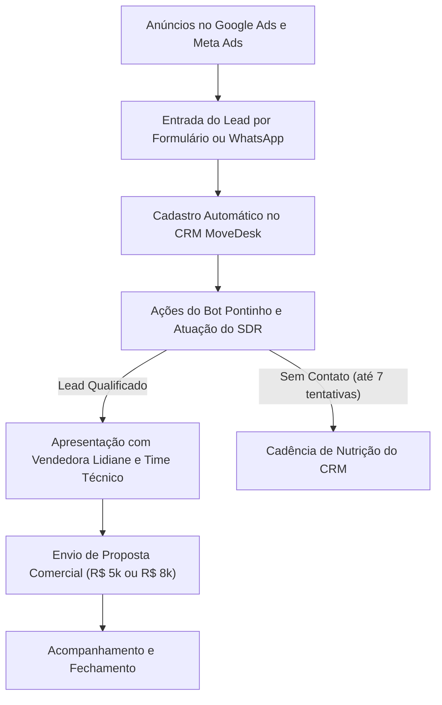
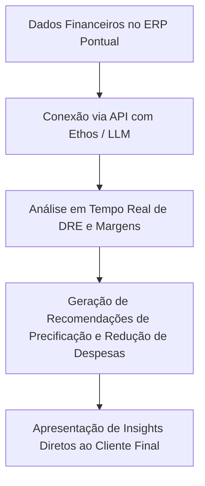

# Fluxos encontrados

- Reunião: [kick-off] Adapta Native & Pontual Tecnologia
- Data: 2026-08-11
- Link tl;dv: https://tldv.io/app/meetings/6a7b712759bb83001320b864
- Fonte: transcrição e metadados retornados pela API do tl;dv.

## Observação
Os fluxos abaixo representam o processo atual de aquisição comercial e o processo futuro/desejado de inteligência financeira citado na reunião.

## Processo Atual de Aquisição e Qualificação Comercial (atual)

## Integração de Inteligência Financeira e DRE no ERP (desejado)

