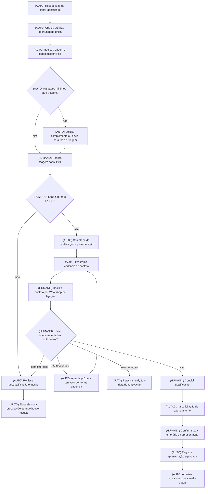

# Escopo do Plano — Aquisição e Qualificação de Leads até Agendamento de Apresentação

**Empresa:** Pontual Tecnologia  
**Processo master:** Aquisição, qualificação e encaminhamento de leads até o agendamento da apresentação comercial  
**Vídeos-fonte:**
1. *Gravando 2026-08-25 105709.mp4-respondechat.mp4*
2. *Gravando 2026-08-25 115140.mp4-basesdecontatos.mp4*
3. *Gravando 2026-08-25 153417.mp4-CRM2.mp4*
4. *Gravando 2026-08-25 110738.mp4-outrasferramentas.mp4*
5. *Gravando 2026-08-26 104708.mp4playbook.mp4*
6. *WhatsApp Video 2026-08-26 at 11.21.36.mp4*
7. *WhatsApp Video 2026-08-26 at 11.21.45.mp4*

**Arquivos de contexto usados:** Contexto do cliente, diagnóstico DMO e *Pontual Tech.pdf*.  
**Arquivo referenciado, não lido:** *[pontual] Map de Processos.pdf*. Seu conteúdo não foi utilizado nem inferido.  
**Data:** 28/08/2026

---

## 2. Objetivo do sistema

A Pontual possui boa conversão quando um lead qualificado chega à apresentação comercial — aproximadamente 60%, conforme *Pontual Tech.pdf* —, mas perdeu previsibilidade na aquisição de oportunidades qualificadas. O problema consolidado não está apenas em “fazer mais disparos”: está na ausência de uma operação única, rastreável e estruturada para receber, qualificar, priorizar, nutrir e agendar leads oriundos de anúncios, indicações, parceiros, site, WhatsApp e bases de prospecção.

Hoje, a operação está fragmentada entre CRM Pontual, RespondeChat, WhatsApp, Excel/SharePoint, Google Sheets, Outlook e controles informais por cores, etiquetas e observações livres. Isso produz duplicidade de registros, entrada de leads desqualificados diretamente na operação comercial, perda de velocidade de resposta, cadências instáveis e baixa confiabilidade dos indicadores.

O sistema proposto organizará o processo reformado de **ICP → captura → triagem → qualificação → cadência → agendamento da apresentação**, atendendo principalmente aos papéis de:

- SDR / Comercial;
- Responsável Comercial;
- Gestão/Diretoria Comercial;
- Parceiros de geração de leads, quando houver compartilhamento controlado de retorno;
- Equipe responsável por tráfego pago, por meio de indicadores e devolutivas de qualidade dos leads.

O resultado esperado é uma operação comercial previsível, com meta inicial de:

- **≥ 20 leads qualificados por mês**;
- **≥ 10 apresentações comerciais realizadas por mês**;
- **CPL qualificado ≤ R$ 200**.

O escopo encerra-se no **agendamento e registro da apresentação comercial**. Proposta, assinatura, faturamento, implantação, CS, comissões e pós-venda são interfaces relevantes, mas permanecem fora do limite funcional inicial deste projeto.

---

## 2.1 Resumo da entrega

Será entregue um sistema de gestão comercial e qualificação de leads que centraliza as entradas de oportunidades, organiza o funil, aplica regras de triagem, conduz cadências previsíveis, registra o histórico comercial e permite agendar apresentações. O sistema será utilizado pela equipe Comercial e pela gestão para reduzir controles paralelos em planilhas, evitar contatos indevidos, priorizar leads aderentes ao ICP e acompanhar a origem e a evolução de cada oportunidade até a apresentação.

---

## 3. Visão geral do fluxo reformado

### As-is consolidado

O fluxo real observado possui múltiplas entradas e controles paralelos:

1. Leads chegam por tráfego pago, indicação, parceiros como Hiper, disparos de WhatsApp, site, e-mails e chamados transferidos pelo suporte.
2. Parte dos leads do site chega no número de WhatsApp `Comunicação`, utilizado prioritariamente pelo Financeiro, e é transferida manualmente ao Comercial.
3. A vendedora registra e acompanha oportunidades em planilha Excel/SharePoint, usando cores para representar estágio e prioridade.
4. Bases de prospecção recebidas em Google Sheets são copiadas e formatadas manualmente em um modelo Excel rígido para importação no RespondeChat.
5. Disparos de prospecção dependem de monitoramento manual, tanto porque o RespondeChat pode quebrar cadências quanto porque respostas fora do fluxo exigem pausa manual.
6. A qualificação e os follow-ups são registrados em planilha, sem padronização plena de campos, critérios de etapa ou histórico.
7. Após a qualificação, a equipe realiza contato por WhatsApp e ligação, conduz a demonstração e registra o avanço manualmente.

### To-be: atividades eliminadas

| Atividade atual | Rota | Justificativa |
|---|---|---|
| Copiar e colar contatos entre planilha bruta e modelo de importação de quatro colunas | **ELIMINAR** | É retrabalho decorrente da limitação do RespondeChat, sem gerar valor comercial direto. |
| Usar cores de linha como principal mecanismo de controle de funil | **ELIMINAR** | As cores concentram conhecimento tácito e não garantem regras, alertas, rastreabilidade ou indicadores confiáveis. |
| Conferir e expurgar manualmente, linha a linha, contatos que pediram para não receber mensagens | **ELIMINAR** | O pedido de não contato deve ser registrado uma vez e aplicado automaticamente a futuras ações. |
| Atualizar manualmente planilhas de rotina diária e resumo semanal com contagem de atividades | **ELIMINAR** | As métricas devem decorrer das ações registradas no processo, e não de nova digitação. |
| Transferir manualmente, como rotina, lead comercial da linha `Comunicação` para a área Comercial | **ELIMINAR** | A entrada comercial deve ser direcionada ao fluxo comercial desde a origem ou classificada automaticamente na chegada. |

### To-be: automações determinísticas

| Atividade reformada | Rota | Justificativa |
|---|---|---|
| Criar um registro único para cada lead recebido | **AUTOMAÇÃO DETERMINÍSTICA** | Evita duplicidade e concentra origem, dados, contatos e movimentações em uma oportunidade rastreável. |
| Classificar a origem do lead | **AUTOMAÇÃO DETERMINÍSTICA** | A origem é um dado estruturado já utilizado pela Pontual: indicação, tráfego pago, parceiro Hiper, disparo massivo, contato antigo, suporte e outros observados. |
| Identificar campos obrigatórios para qualificação | **AUTOMAÇÃO DETERMINÍSTICA** | O Playbook já aponta dados comerciais necessários, como segmento, sistema atual, regime tributário, estágio de abertura da loja e número de usuários/acessos. |
| Aplicar status e próximos passos | **AUTOMAÇÃO DETERMINÍSTICA** | O sistema pode criar filas, tarefas e alertas conforme a etapa, tentativas realizadas, retorno e data da próxima ação. |
| Controlar a cadência mínima de contato | **AUTOMAÇÃO DETERMINÍSTICA** | Há evidência de padrão mínimo de três tentativas, alternando WhatsApp e ligação. A regra pode virar fluxo rastreável após validação. |
| Bloquear novos disparos para contatos com recusa explícita | **AUTOMAÇÃO DETERMINÍSTICA** | Já é uma regra operacional observada: quem responde “sem interesse” deve sair de futuras listas. |
| Gerar listas de prospecção no formato operacional necessário | **AUTOMAÇÃO DETERMINÍSTICA** | O sistema deve produzir a lista com os campos necessários sem exigir transformação manual em planilhas. |
| Criar indicadores por canal, etapa e responsável | **AUTOMAÇÃO DETERMINÍSTICA** | Os indicadores passam a ser calculados a partir das ações e mudanças de status registradas. |
| Alertar ausência de resposta e pendências de follow-up | **AUTOMAÇÃO DETERMINÍSTICA** | O alerta decorre de regra objetiva: data da próxima ação vencida, tentativa pendente ou lead sem atendimento inicial. |

### To-be: etapas que permanecem humanas

| Atividade reformada | Rota | Como o sistema apoia |
|---|---|---|
| Conversa de qualificação | **MANTER HUMANO** | Exibe roteiro consultivo, campos de qualificação, histórico, origem e dados conhecidos do lead. |
| Avaliar aderência real ao ICP em casos não evidentes | **MANTER HUMANO** | Solicita decisão de qualificado, desqualificado ou nutrição, registrando motivo padronizado. |
| Responder perguntas específicas ou não previstas do lead | **MANTER HUMANO** | Direciona a conversa para uma fila humana e interrompe a cadência daquele contato. |
| Conduzir ligação e apresentação comercial | **MANTER HUMANO** | Organiza agenda, contexto da oportunidade e registro do resultado. |
| Decidir reativação de oportunidade pausada | **MANTER HUMANO** | Apresenta motivo da pausa, histórico e prazo de retorno programado. |
| Definir ajustes de ICP, campanhas e mensagens | **MANTER HUMANO** | Entrega dados consolidados para decisão gerencial e comercial. |

### Diagrama do fluxo reformado — escopo base

---

## 4. Funcionalidades

### 4.1 Cadastro único de leads e oportunidades

**O que faz:** cria e mantém um registro central de cada empresa e oportunidade comercial, com histórico de contatos, origem, qualificação, etapa e próxima ação. Quando houver dados já cadastrados, o sistema sinaliza possível duplicidade para evitar registros paralelos.

**Para quem:** SDR, Comercial e gestão comercial.

**Dor resolvida:** uso simultâneo de CRM Pontual, RespondeChat e planilha `CRM - Acompanhamento - ok`, com risco de divergência e duplicação.  
**Fonte:** *outrasferramentas.mp4*, 02:27–06:15; *CRM2.mp4*, 00:00–05:36.

**Rota:** Automação determinística.

---

### 4.2 Entrada e classificação de leads por origem

**O que faz:** registra a origem de toda oportunidade e permite identificar os canais efetivos de aquisição: indicação, tráfego pago, parceiro Hiper, disparo massivo, contato antigo, suporte, site/Google e outros canais que venham a ser validados.

**Para quem:** SDR, Comercial, gestão e responsáveis por mídia.

**Dor resolvida:** falta de visibilidade confiável sobre quais canais produzem leads qualificados e apresentações; entrada de leads desqualificados vindos de tráfego pago.  
**Fonte:** *CRM2.mp4*, 00:22–01:44; *Pontual Tech.pdf*, seção “Principal gargalo”.

**Rota:** Automação determinística.

---

### 4.3 Triagem inicial e qualificação estruturada

**O que faz:** apresenta ao operador uma ficha de qualificação com as informações já utilizadas ou previstas no Playbook: segmento, cidade/bairro, sistema atual, fonte do lead, regime tributário, status de abertura da loja, número de acessos/usuários e produto/funil aplicável.

A qualificação deve ser conduzida como conversa comercial, não como questionário rígido. O sistema organiza os campos obrigatórios e o histórico, mas o operador decide a aderência.

**Para quem:** SDR e Comercial.

**Dor resolvida:** leads sem perfil chegam diretamente à vendedora e a qualificação depende da memória ou de observações livres.  
**Fonte:** *CRM2.mp4*, 01:08–01:44; *playbook.mp4*, 01:19–02:20.

**Rota:** Apoio a etapa humana.

---

### 4.4 Regras de elegibilidade e motivo de descarte

**O que faz:** permite classificar leads como qualificados, desqualificados, sem interesse, perdido, pausado/nutrição ou em andamento, exigindo o registro de um motivo padronizado quando houver descarte, recusa ou pausa.

Inclui mecanismo de bloqueio de novas ações de prospecção para contatos que manifestaram recusa explícita.

**Para quem:** SDR, Comercial e gestão.

**Dor resolvida:** expurgo manual de contatos em listas de disparo e uso de cores para representar perda, pausa ou oportunidade ativa.  
**Fonte:** *CRM2.mp4*, 03:04–04:51; *outrasferramentas.mp4*, 03:57–05:35.

**Rota:** Automação determinística, com decisão humana de classificação.

---

### 4.5 Gestão de cadência e tarefas de follow-up

**O que faz:** cria automaticamente a próxima ação comercial conforme a etapa e a tentativa anterior, exibindo uma fila diária de contatos pendentes. Permite registrar contato por WhatsApp, ligação, e-mail ou outro canal validado.

A cadência não deve avançar quando o contato estiver marcado como sem interesse, desqualificado, em pausa ou com apresentação já agendada.

**Para quem:** SDR e Comercial.

**Dor resolvida:** controle manual de primeira, segunda e terceira tentativas em Excel; risco de perda de follow-up e concentração do conhecimento na executora.  
**Fonte:** *CRM2.mp4*, 02:21–02:33; *outrasferramentas.mp4*, 03:57–04:54.

**Rota:** Automação determinística.

**[EVOLUÇÃO IA]** Uma IA generativa pontual poderia sugerir uma redação de follow-up a partir do histórico, sem decidir etapa, prioridade ou contato.

---

### 4.6 Gestão de bases de prospecção

**O que faz:** recebe ou registra bases de contatos oriundas de parceiros e organiza os contatos para uso comercial sem necessidade de copiar, colar, apagar linhas antigas ou adaptar manualmente um modelo de Excel.

A funcionalidade deve permitir associar cada contato à origem da base e ao contexto comercial, como `Prospect Hiper`, desde que essa classificação seja validada pela Pontual.

**Para quem:** SDR e Comercial.

**Dor resolvida:** preparação manual de planilhas brutas em Google Sheets para o modelo de quatro colunas exigido pelo RespondeChat.  
**Fonte:** *basesdecontatos.mp4*, 01:53–04:27.

**Rota:** Automação determinística.

---

### 4.7 Controle de campanhas e contatos de prospecção

**O que faz:** organiza ações de prospecção por base, origem, segmento e status comercial. Permite selecionar contatos elegíveis e exclui automaticamente aqueles bloqueados por recusa explícita ou descarte.

O sistema registra a data da ação e o resultado do contato, sem depender de acompanhamento por linhas brancas, vermelhas, amarelas ou laranjas.

**Para quem:** SDR, Comercial e gestão.

**Dor resolvida:** disparos com controles desconectados, triagem manual de respostas negativas e reenvio indevido para contatos que não querem receber mensagens.  
**Fonte:** *CRM2.mp4*, 04:15–04:51; *respondechat.mp4*, 05:41–08:10.

**Rota:** Automação determinística, com atendimento humano quando houver resposta contextual.

---

### 4.8 Tratamento de exceções e respostas fora do roteiro

**O que faz:** quando o lead responde algo que exige análise humana — por exemplo, pergunta sobre a origem do contato —, o sistema sinaliza a conversa para atendimento humano e interrompe a sequência prevista para aquele lead até nova decisão do operador.

**Para quem:** SDR e Comercial.

**Dor resolvida:** necessidade de monitorar o disparo continuamente e pausar manualmente o bot no RespondeChat em perguntas fora do fluxo.  
**Fonte:** *basesdecontatos.mp4*, 04:57–05:39.

**Rota:** Apoio a etapa humana.

---

### 4.9 Agendamento de apresentação comercial

**O que faz:** registra o interesse validado, cria uma solicitação de agendamento, registra data e horário confirmados da apresentação e movimenta a oportunidade para a etapa correspondente.

**Para quem:** SDR e Comercial.

**Dor resolvida:** o processo alvo do projeto exige medir a passagem de lead qualificado para apresentação; hoje essa transição é controlada manualmente em planilha.  
**Fonte:** *playbook.mp4*, 01:19–03:02; *Pontual Tech.pdf*, critérios de sucesso.

**Rota:** Automação determinística, com confirmação humana do agendamento.

---

### 4.10 Painel de gestão de aquisição e qualificação

**O que faz:** consolida indicadores de volume e qualidade por canal, etapa, responsável e período, incluindo:

- leads recebidos;
- leads qualificados;
- leads desqualificados;
- motivos de descarte;
- apresentações agendadas;
- apresentações realizadas, se esse registro for incluído;
- tempo até primeiro contato;
- quantidade de tentativas;
- taxa de qualificação por origem;
- taxa de agendamento por origem;
- investimento em mídia informado manualmente e CPL qualificado calculado.

**Para quem:** Gestão, Diretoria, Comercial e responsáveis por tráfego.

**Dor resolvida:** lançamento manual de métricas em planilhas e ausência de uma visão confiável sobre a qualidade dos canais.  
**Fonte:** *outrasferramentas.mp4*, 06:16–07:17; *Pontual Tech.pdf*, critérios de sucesso.

**Rota:** Automação determinística.

---

## 5. Regras de negócio

1. **[REGRA ATUAL OBSERVADA]** Leads provenientes de site e Google entram no número `Comunicação`, que também é utilizado pelo Financeiro.  
   **Fonte:** *respondechat.mp4*, 00:54–01:15.

2. **[PROPOSTA]** Todo ponto de captura comercial deve identificar a origem do lead e direcioná-lo ao fluxo Comercial, sem depender da linha financeira como porta de entrada comercial.

3. **[REGRA ATUAL OBSERVADA]** O padrão mínimo de contato envolve três tentativas, alternando WhatsApp e ligação, antes da classificação como perdido ou sem interesse.  
   **Fonte:** *outrasferramentas.mp4*, 05:04; *CRM2.mp4*, 02:21–02:33.

4. **[PROPOSTA]** A classificação como perdido por ausência de resposta só poderá ocorrer após a conclusão da cadência mínima validada pela Pontual, com registro das tentativas e seus canais.

5. **[REGRA ATUAL OBSERVADA]** Um lead que declara “sem interesse” ou que já possui sistema consolidado deve ser removido de futuros disparos de WhatsApp.  
   **Fonte:** *CRM2.mp4*, 04:48.

6. **[PROPOSTA]** O bloqueio de contato deve prevalecer automaticamente sobre qualquer lista, campanha ou cadência futura, até eventual revisão humana devidamente registrada.

7. **[REGRA ATUAL OBSERVADA]** Leads que optam por solução gratuita, como a ferramenta do SEBRAE, podem permanecer em base de nutrição para retorno posterior.  
   **Fonte:** *CRM2.mp4*, 03:04–03:45.

8. **[REGRA ATUAL OBSERVADA]** O retorno para leads que adotaram solução gratuita foi citado como podendo ocorrer em 30 a 60 dias.  
   **Fonte:** *CRM2.mp4*, 03:18.

9. **[PROPOSTA]** O prazo de reativação deve ser escolhido a partir de opções padronizadas e validado por motivo de pausa, evitando que a nutrição fique apenas em observação textual.

10. **[REGRA ATUAL OBSERVADA]** A qualificação deve ocorrer de forma consultiva, sem transformar a conversa em interrogatório.  
    **Fonte:** *playbook.mp4*, 01:40.

11. **[REGRA ATUAL OBSERVADA]** A qualificação considera, entre outros dados, regime tributário, situação de abertura da loja e número de acessos/usuários necessários.  
    **Fonte:** *playbook.mp4*, 01:58.

12. **[PROPOSTA]** O sistema deve exigir os dados mínimos de qualificação antes de permitir a passagem para apresentação, mas deve permitir marcar “não informado” quando o dado ainda não tiver sido obtido, registrando a pendência para o operador.

13. **[REGRA ATUAL OBSERVADA]** O Hiper não atende farmácias nem postos de gasolina; o foco observado é comércio varejista, como bazar, vestuário e acessórios.  
    **Fonte:** *CRM2.mp4*, 05:12.

14. **[PROPOSTA]** As regras de ICP e aderência por produto devem ser confirmadas e transformadas em critérios explícitos de triagem, sem presumir que a restrição do Hiper se aplica igualmente a todos os produtos Pontual.

15. **[REGRA ATUAL OBSERVADA]** A última semana de cada mês é priorizada para fechamento de propostas e negociações abertas.  
    **Fonte:** *outrasferramentas.mp4*, 09:21.

16. **[FORA DO ESCOPO BASE]** Regras de proposta, descontos, bonificações, assinatura, faturamento, comissões e implantação foram observadas em vídeos, mas não serão automatizadas neste escopo de aquisição até agendamento. Elas deverão receber escopo próprio em etapa posterior.

---

## 6. Automações

### 6.1 Criação e deduplicação de oportunidade

- **Gatilho:** chegada de novo lead por canal comercial ou inclusão de base de prospecção.
- **Regra:** o sistema procura registros existentes com os identificadores disponíveis e sinaliza potencial duplicidade.
- **Resultado:** cria nova oportunidade ou direciona o operador para atualizar o registro já existente.
- **Antes:** inserção manual em planilhas, chat e CRM paralelamente.
- **Ganho esperado:** redução de retrabalho e de múltiplos históricos para o mesmo contato.

---

### 6.2 Classificação de origem e canal

- **Gatilho:** criação da oportunidade.
- **Regra:** registra a origem informada no ponto de entrada, como tráfego pago, indicação, parceiro Hiper, disparo massivo ou suporte.
- **Resultado:** cada oportunidade fica vinculada a uma origem mensurável.
- **Antes:** origem registrada manualmente em planilha ou dispersa entre sistemas.
- **Ganho esperado:** visibilidade de conversão e qualidade por canal.

---

### 6.3 Encaminhamento para triagem comercial

- **Gatilho:** lead recebido com dados mínimos disponíveis.
- **Regra:** leads comerciais entram na fila de triagem do Comercial; solicitações não comerciais ou sem dados suficientes são direcionadas para tratamento adequado.
- **Resultado:** evita que leads comerciais dependam de transferência manual pelo Financeiro.
- **Antes:** lead do site/Google chega à linha `Comunicação` e requer handoff manual.
- **Ganho esperado:** redução do tempo até primeiro contato.

---

### 6.4 Criação de próxima ação e controle de cadência

- **Gatilho:** oportunidade qualificada para abordagem ou tentativa de contato concluída.
- **Regra:** conforme o status e número de tentativas, o sistema cria a próxima ação de contato para o responsável.
- **Resultado:** fila priorizada de follow-ups, sem depender de cores, memória ou atualização em Excel.
- **Antes:** registro de primeira, segunda e terceira tentativas em planilha.
- **Ganho esperado:** menor risco de oportunidade esquecida e maior disciplina comercial.

**[EVOLUÇÃO IA]** IA generativa pontual poderá sugerir textos de follow-up, sempre com revisão e envio humano.

---

### 6.5 Bloqueio automático para recusa explícita

- **Gatilho:** operador registra “sem interesse”, “não deseja contato” ou motivo equivalente validado.
- **Regra:** o contato torna-se inelegível para novas campanhas e cadências de prospecção.
- **Resultado:** o sistema impede sua seleção em ações futuras.
- **Antes:** expurgo manual em planilhas e listas.
- **Ganho esperado:** redução de risco de insistência indevida, insatisfação e bloqueio de canal.

---

### 6.6 Reativação programada de oportunidades pausadas

- **Gatilho:** operador classifica uma oportunidade como pausa/nutrição.
- **Regra:** registra motivo e data de retorno.
- **Resultado:** a oportunidade reaparece na fila na data definida, em vez de ficar apenas marcada visualmente.
- **Antes:** linha laranja e observações livres na planilha.
- **Ganho esperado:** recuperação organizada de oportunidades sem perda de contexto.

---

### 6.7 Indicadores automáticos

- **Gatilho:** movimentação de etapa, registro de contato, qualificação, descarte ou agendamento.
- **Regra:** o sistema consolida os eventos por origem, responsável, período e etapa.
- **Resultado:** painel atualizado sem lançamento duplicado em rotina diária e resumo semanal.
- **Antes:** contagem manual de mensagens, ligações, follow-ups e reuniões.
- **Ganho esperado:** indicadores mais confiáveis e menos carga administrativa.

---

## 7. Fluxos do usuário

### 7.1 SDR / Comercial — triagem de novo lead

1. Acessa a fila de novos leads.
2. Visualiza nome da empresa, contato, canal de origem, data de entrada e eventuais dados já capturados.
3. Confirma ou corrige possível duplicidade.
4. Inicia a conversa de triagem.
5. Registra os dados de qualificação obtidos.
6. Decide entre: desqualificar, iniciar cadência, pausar/nutrir ou encaminhar para agendamento.
7. Informa motivo estruturado quando desqualificar ou pausar.
8. O sistema cria a próxima ação conforme a decisão.

---

### 7.2 SDR / Comercial — execução de follow-ups

1. Acessa a fila diária de ações pendentes.
2. Visualiza o histórico completo da oportunidade, últimas interações e próxima ação prevista.
3. Realiza o contato pelo canal aplicável.
4. Registra o resultado: sem resposta, interessado, sem interesse, retorno futuro ou dados insuficientes.
5. Se houver pergunta fora do roteiro, assume o atendimento humano e pausa a cadência daquele lead.
6. O sistema cria a próxima ação ou movimenta a oportunidade de etapa.

---

### 7.3 SDR / Comercial — agendamento de apresentação

1. Abre a oportunidade já qualificada.
2. Confere os dados mínimos de qualificação e o histórico de contexto.
3. Registra a intenção de apresentação.
4. Negocia e confirma data e horário com o lead.
5. Registra o agendamento.
6. O sistema altera o status para `Apresentação Agendada` e atualiza os indicadores.

---

### 7.4 Gestão Comercial

1. Acessa o painel de aquisição e qualificação.
2. Filtra período, canal, produto, responsável ou etapa.
3. Avalia leads recebidos, qualificados, descartados, pausados e apresentações agendadas.
4. Compara qualidade de leads por origem.
5. Analisa motivos de desqualificação para orientar campanhas e ICP.
6. Identifica follow-ups vencidos e oportunidades sem resposta.
7. Usa os dados na reunião de alinhamento comercial e com responsáveis por tráfego.

---

### 7.5 Parceiro de geração de leads — quando aplicável

1. Recebe uma visão limitada dos leads provenientes de sua origem.
2. Visualiza status de tratamento e retorno comercial permitido pela Pontual.
3. Não acessa informações de outras origens ou oportunidades fora de sua carteira.
4. A Pontual valida previamente quais dados podem ser compartilhados.

---

## 8. Dados e informações necessárias

| Informação | Origem |
|---|---|
| Data Entrada | Capturada no momento de criação da oportunidade |
| Nome Empresa | Input do usuário, formulário, base de parceiro ou outro canal |
| Razão Social | Base recebida, input do usuário ou pesquisa operacional validada |
| CNPJ | Base recebida, input do usuário ou dado já existente |
| Contato / Decisor | Input do usuário ou conversa comercial |
| Tel / WhatsApp | Canal de entrada, base de contatos ou input do usuário |
| E-mail | Canal de entrada, base de contatos ou input do usuário |
| Segmento | Input humano durante qualificação |
| Cidade/Bairro | Base recebida ou input humano |
| Sistema Atual | Input humano durante qualificação |
| Fonte do Lead | Captura automática ou seleção pelo operador |
| Produto / Funil aplicável | Seleção humana conforme necessidade identificada |
| Regime tributário | Input humano durante qualificação |
| Status de abertura da loja | Input humano durante qualificação |
| Número de acessos/usuários necessários | Input humano durante qualificação |
| Etapa do Funil | Calculada ou selecionada conforme ação do operador |
| Motivo de desqualificação | Seleção humana em lista padronizada a validar |
| Motivo de pausa/nutrição | Seleção humana em lista padronizada a validar |
| Primeira, segunda e terceira tentativa | Gerado a partir das ações registradas |
| Última interação | Gerada a partir da última ação registrada |
| Próxima ação | Calculada pela cadência ou definida pelo operador |
| Data de reativação | Informada pelo operador quando houver pausa/nutrição |
| Status de consentimento/recusa de contato | Registrado por decisão humana e aplicado automaticamente |
| Data e horário da apresentação | Registrados no agendamento |
| Responsável comercial | Definido na distribuição ou alterado por responsável autorizado |
| Investimento por canal | Informado pela gestão ou responsável por mídia |
| Leads qualificados e CPL qualificado | Calculados pelo sistema a partir dos dados registrados |

**Observação:** `Valor Proposta`, `Data Fechamento`, regras de desconto, contrato, comissão e faturamento foram observados nos materiais, mas permanecem fora do escopo funcional inicial, pois ocorrem após a apresentação comercial ou após o fechamento.

---

## 9. Evoluções sugeridas com IA (opcional — fora do escopo base)

O sistema descrito nas seções anteriores funciona integralmente sem IA. As possibilidades abaixo são evoluções opcionais, para avaliação somente após a operação determinística estar estabilizada.

### 9.1 Sugestão de redação para follow-up

**Etapa de origem:** cadência de contato e follow-ups.  
**Tipo:** IA generativa pontual.

**O que faria:** sugerir um texto de WhatsApp ou e-mail com base no produto, etapa, origem e histórico da oportunidade.

**Ganho potencial:** reduzir o tempo para redigir mensagens e oferecer consistência de linguagem ao time comercial.

**Trade-offs aceitos pelo cliente:**

- custo por execução;
- menor previsibilidade de redação;
- necessidade de revisão humana antes do envio;
- necessidade de política comercial e linguagem institucional definidas.

**Limite:** a IA não deve definir se o lead é qualificado, mudar a etapa do funil, disparar mensagens sozinha ou ignorar bloqueios de contato.

---

### 9.2 Resumo de histórico para preparação de atendimento

**Etapa de origem:** atendimento humano de oportunidades com muitas interações.  
**Tipo:** IA generativa pontual.

**O que faria:** gerar um resumo do histórico registrado, destacando origem, dores mencionadas, produto de interesse, objeções, tentativas realizadas e próxima ação.

**Ganho potencial:** reduzir o tempo de leitura antes de uma ligação ou apresentação.

**Trade-offs aceitos pelo cliente:**

- custo por geração de resumo;
- possibilidade de resumo incompleto ou impreciso;
- conferência humana obrigatória antes de usar a informação em decisão comercial.

**Limite:** a IA não deve concluir a qualificação, prometer condições comerciais ou registrar decisões sem validação do usuário.

---

## 10. Sugestões estratégicas e alternativas (fora do sistema)

### 10.1 Revisar a segmentação e a mensagem das campanhas de tráfego pago

**Dor declarada:** leads de tráfego pago chegam procurando material de construção, em vez de software de gestão.  
**Evidência:** *CRM2.mp4*, 01:08–01:44.

**Cadeia de porquês:**

1. A vendedora recebe leads desqualificados.
2. Porque pessoas buscam compra de insumos ou produtos de varejo, não um ERP.
3. Porque a campanha, a palavra-chave, o criativo, a página de destino ou o formulário podem não diferenciar claramente a Pontual de uma loja de materiais.
4. Porque a qualidade do lead não está sendo retroalimentada sistematicamente para a gestão de mídia.
5. Porque não há um ciclo formal de medição por canal, motivo de descarte e aprendizado comercial.

**Sugestão:** criar uma rotina quinzenal ou mensal entre Comercial e responsável por mídia para revisar:

- termos de busca e segmentação;
- anúncios e criativos;
- promessa comercial;
- campos do formulário;
- motivos de descarte por campanha;
- taxa de qualificação e agendamento por origem.

**Benefício esperado:** menor volume de leads irrelevantes e maior proporção de oportunidades aderentes ao ICP.

**O que validar:**  
`[HIPÓTESE]` A origem dos leads desqualificados é predominantemente Google Ads ou Meta Ads, e não uma combinação de canais. É necessário analisar os dados reais por campanha antes de alterar investimento ou segmentação.

---

### 10.2 Redirecionar a entrada comercial do site

**Dor declarada:** leads de site/Google entram na linha `Comunicação`, utilizada pelo Financeiro, e são transferidos manualmente.  
**Evidência:** *respondechat.mp4*, 00:54–01:15.

**Cadeia de porquês:**

1. O Comercial pode responder mais tarde do que deveria.
2. Porque o lead entra primeiro em uma linha não dedicada à área comercial.
3. Porque o contato exibido no site está configurado para a linha `Comunicação`.
4. Porque a organização do canal foi estruturada por conveniência operacional anterior, e não pelo fluxo atual de aquisição.
5. Porque não há uma definição única de propriedade e SLA para entradas comerciais.

**Sugestão:** revisar os pontos de contato comerciais do site, anúncios e perfis públicos para que direcionem o lead diretamente ao fluxo comercial ou a um formulário de triagem.

**Benefício esperado:** redução de handoff, menor tempo até primeira resposta e aumento da chance de contato com o lead ainda engajado.

**O que validar:**  
`[HIPÓTESE]` O número `Comunicação` é o único ou principal ponto de entrada comercial público. É necessário mapear todos os botões, anúncios e perfis ativos.

---

### 10.3 Substituir a lógica de “disparo em massa” por prospecção elegível e controlada

**Dor declarada:** o RespondeChat dispara mensagens de cadência simultaneamente, exige auditoria de até 100 conversas e cria risco de bloqueio e insatisfação.  
**Evidência:** *respondechat.mp4*, 07:18–08:10.

**Cadeia de porquês:**

1. A equipe precisa revisar conversas manualmente após falhas.
2. Porque o motor de cadência não respeita os intervalos planejados.
3. Porque a ferramenta atual apresenta instabilidade ou limitação operacional.
4. Porque o processo comercial depende da ferramenta para executar uma atividade crítica sem controle alternativo confiável.
5. Porque a escolha e governança dos canais de contato não foram definidas a partir de critérios de estabilidade, rastreabilidade e elegibilidade.

**Sugestão:** antes de construir ou contratar qualquer solução de disparo, definir uma política comercial de prospecção contendo:

- quem pode entrar em campanhas;
- quais motivos bloqueiam novo contato;
- qual cadência é permitida;
- quais mensagens exigem aprovação;
- quais respostas suspendem o fluxo;
- como registrar origem e base legal/consentimento aplicável, caso necessário.

**Alternativa:** avaliar a manutenção, substituição ou redução de dependência do RespondeChat como ferramenta central de prospecção. O sistema proposto deve manter a lógica comercial e os dados sob controle da Pontual, sem reproduzir a dependência de uma cadência instável.

**Benefício esperado:** redução de risco reputacional, menor retrabalho e maior previsibilidade operacional.

**O que validar:**  
`[HIPÓTESE]` A falha de cadência é recorrente e não pontual. É necessário medir frequência, impacto e possibilidade de correção pelo fornecedor antes de decidir pela substituição.

---

### 10.4 Formalizar o ICP por produto e etapa

**Dor declarada:** a Pontual quer gerar leads qualificados de forma previsível, mas a definição de qualificação ainda é parcialmente tácita.  
**Evidência:** *Pontual Tech.pdf*, “Mapear ICP e qualificação”; *playbook.mp4*, 01:19–02:20.

**Cadeia de porquês:**

1. A operação recebe oportunidades que não avançam.
2. Porque nem todos os leads atendem ao perfil ou momento de compra adequado.
3. Porque os critérios de qualificação são registrados de forma dispersa entre conversa, planilha e conhecimento da vendedora.
4. Porque o Playbook Comercial ainda está em elaboração.
5. Porque a empresa dependia de indicação e experiência individual mais do que de um processo formal de aquisição.

**Sugestão:** validar e publicar uma matriz de ICP por produto ou funil, contendo ao menos:

- segmentos prioritários;
- segmentos inelegíveis;
- situação da empresa;
- produto ou solução aplicável;
- sistema atual;
- nível de urgência ou momento de troca;
- dados mínimos antes da apresentação;
- motivos padronizados de descarte.

**Benefício esperado:** campanhas mais assertivas, qualificação consistente, treinamento mais rápido de novos SDRs e análise real de qualidade por canal.

**O que validar:**  
`[HIPÓTESE]` Os critérios de regime tributário, número de usuários e status de abertura são necessários para todos os produtos, e não apenas para determinadas soluções.

---

## 11. Reflexão final: perguntas, lacunas e causas-raiz

### Perguntas a serem respondidas pelo cliente

| Pergunta | Motivo e impacto no escopo |
|---|---|
| Qual é o volume semanal médio de contatos prospectados e disparados? | Define capacidade esperada, priorização de automações e indicadores operacionais. |
| Qual é a taxa e a frequência das falhas de cadência no RespondeChat? | Define se será necessária substituição do fluxo atual, contingência operacional ou apenas correção pontual. |
| Quantos leads por dia entram na linha `Comunicação` e quanto tempo levam para chegar ao Comercial? | Define o impacto real do handoff Financeiro → Comercial e a prioridade de redirecionamento do canal. |
| Quais são todos os canais ativos de geração de leads e quais deles possuem investimento recorrente? | Necessário para medir custo, qualidade e conversão por canal. |
| Como os leads de tráfego pago chegam hoje: formulário, WhatsApp, ligação, Instagram ou outro meio? | Define os pontos de captura e os dados disponíveis para triagem. |
| Existe um SLA comercial esperado para primeiro contato após entrada do lead? | Necessário para criar alertas e medir velocidade de atendimento. |
| O CRM Pontual possui pipeline comercial configurável e utilizável pelo Comercial? | Define se o escopo será uma evolução do CRM atual, uma camada complementar de processo ou uma solução substitutiva. |
| O CRM Pontual permite registrar etapas, tarefas, histórico e indicadores comerciais necessários? | Define o nível de centralização possível sem controles paralelos. |
| Qual ferramenta realiza efetivamente os disparos massivos hoje? | Há menções ao RespondeChat e ao WhatsApp, mas é necessário confirmar a operação vigente. |
| Quais critérios definitivos caracterizam um lead qualificado para cada produto? | Determina as regras de triagem e os dados obrigatórios antes do agendamento. |
| Quais segmentos são inelegíveis para cada produto da Pontual? | Evita aplicar a restrição observada no Hiper a produtos para os quais ela talvez não se aplique. |
| A regra de três tentativas é obrigatória para todos os tipos de lead? | Define a cadência determinística e suas exceções para indicação, parceiro ou lead quente. |
| Qual é o intervalo esperado entre as tentativas de contato? | Sem essa resposta, o sistema pode controlar quantidade de tentativas, mas não programar prazos definitivos. |
| Quais motivos devem ser oferecidos para desqualificação, perda e pausa/nutrição? | Necessário para indicadores confiáveis e retroalimentação de marketing. |
| Quem pode reativar um contato bloqueado por recusa explícita e sob quais condições? | Define governança para impedir contatos indevidos. |
| Qual informação do funil pode ser compartilhada com a gerência Hiper ou outros parceiros? | Define a necessidade de visões externas e limites de acesso. |
| Existe alinhamento periódico com agência ou responsável de tráfego para comunicar desqualificações? | Define se o painel deve gerar uma rotina formal de feedback para mídia. |
| Como é feita a criação da proposta antes do Autentique? | Está fora deste escopo inicial, mas delimita a transição futura entre apresentação e proposta. |
| Quais são os limites de descontos e parcelamentos comerciais? | Está fora do escopo inicial, mas é uma dependência para futura sistematização de proposta e fechamento. |
| Como é feita a validação de recebimento antes do pagamento de comissão? | Está fora do escopo inicial, mas é relevante para futura integração comercial-financeira. |

### Lacunas de informação

1. **Aquisição por canal não demonstrada:** não foram exibidas campanhas de Google Ads, Meta Ads, landing pages, formulários, segmentação, criativos, investimentos ou relatórios de origem.
2. **Agendamento de apresentação não demonstrado:** o objetivo do projeto termina nessa etapa, mas não há vídeo mostrando a confirmação de data/hora, calendário utilizado, lembretes ou taxa de comparecimento.
3. **Demonstração técnica ao vivo não demonstrada:** citada no Playbook, mas não apresentada.
4. **Execução atual de disparos em massa:** há evidências do RespondeChat, porém é necessário confirmar se todas as campanhas continuam naquela ferramenta.
5. **Abertura de chamados, implantação, CS, faturamento e comissões:** foram citados e parcialmente demonstrados, mas estão fora do processo limite deste escopo.
6. **Governança do EAD:** conteúdo desatualizado foi citado, mas não há demonstração nem relação direta confirmada com aquisição até apresentação.
7. **Conteúdo não lido:** *[pontual] Map de Processos.pdf* foi referenciado, mas não foi disponibilizado como texto legível. Qualquer informação nele deverá ser incorporada apenas após leitura.

### Possíveis causas-raiz

#### 1. Baixo volume de leads qualificados

- **Dor:** a Pontual passou de aproximadamente 20–30 leads qualificados mensais para cerca de três leads qualificados no total em três meses.
- **Por quê:** os canais pagos não estão gerando volume ou perfil suficiente de oportunidades aderentes.
- **Por quê:** há evidência de leads que confundem a Pontual com fornecedora de materiais de construção.
- **Por quê:** `[HIPÓTESE]` campanhas, segmentações, termos, criativos ou páginas de captura podem não comunicar com clareza que a Pontual vende ERP e soluções de gestão.
- **Condição de negócio ao final:** ausência de um ciclo estruturado entre qualidade observada pelo Comercial e otimização de aquisição por Marketing/Mídia.

#### 2. Tempo comercial consumido por controle administrativo

- **Dor:** a equipe controla o funil por planilha, cores, observações e registros paralelos.
- **Por quê:** CRM Pontual, RespondeChat e planilha são usados para partes diferentes do mesmo processo.
- **Por quê:** não há uma fonte operacional única para oportunidade, etapa, histórico, tarefa e indicador.
- **Por quê:** o CRM foi adotado recentemente e sua aderência ao funil comercial não foi confirmada.
- **Condição de negócio ao final:** processo comercial cresceu com ferramentas e controles locais, sem uma definição única de operação comercial.

#### 3. Prospecção ativa instável e com risco operacional

- **Dor:** a cadência do RespondeChat pode disparar todas as mensagens de uma vez e exige auditoria manual.
- **Por quê:** a ferramenta não executa os intervalos programados de forma confiável.
- **Por quê:** a Pontual depende de um mecanismo externo instável para uma atividade comercial crítica.
- **Por quê:** não existe uma política central de elegibilidade, cadência, exceção e bloqueio independente da ferramenta.
- **Condição de negócio ao final:** dependência operacional de fornecedor sem processo de contingência e métricas de confiabilidade.

---

## 12. Rastreabilidade

| Decisão de redesenho | Tipo | Evidência |
|---|---|---|
| Eliminar controle principal do funil por cores em planilha | Eliminação | *CRM2.mp4*, 03:04–04:51; *outrasferramentas.mp4*, 02:27–05:35 |
| Centralizar cadastro e histórico em oportunidade única | Automação | *outrasferramentas.mp4*, 02:27–06:15; *CRM2.mp4*, 00:00–05:36 |
| Criar classificação obrigatória por origem | Automação | *CRM2.mp4*, 00:22–01:44; *Pontual Tech.pdf*, “Mapear aquisição por canal” |
| Criar triagem estruturada com campos de qualificação | Apoio humano | *playbook.mp4*, 01:19–02:20 |
| Manter qualificação como conversa consultiva | Manter humano | *playbook.mp4*, 01:40 |
| Usar cadência rastreável de tentativas e próxima ação | Automação | *outrasferramentas.mp4*, 03:57–04:54; 05:04 |
| Bloquear automaticamente novos contatos após recusa | Automação | *CRM2.mp4*, 04:15–04:51; 04:48 |
| Criar reativação com data para oportunidades pausadas | Automação | *CRM2.mp4*, 03:04–03:45; 03:18 |
| Eliminar preparação manual de planilha para disparo | Eliminação | *basesdecontatos.mp4*, 02:20–04:27 |
| Criar gestão central de bases e contatos elegíveis | Automação | *basesdecontatos.mp4*, 01:53–04:57 |
| Direcionar exceções de conversa para atendimento humano | Apoio humano | *basesdecontatos.mp4*, 04:57–05:39 |
| Eliminar dependência da linha Financeiro para entrada comercial | Eliminação / proposta | *respondechat.mp4*, 00:54–01:15 |
| Criar painel automático de atividade e conversão | Automação | *outrasferramentas.mp4*, 06:16–07:17; *Pontual Tech.pdf*, critérios de sucesso |
| Priorizar indicadores de leads qualificados, apresentações e CPL qualificado | Regra proposta | *Pontual Tech.pdf*, “Critérios de sucesso” |
| Revisar campanhas por motivo de descarte e canal | Sugestão estratégica | *CRM2.mp4*, 01:08–01:44; *Pontual Tech.pdf*, “Principal gargalo” |
| Formalizar ICP por produto e critérios de avanço | Sugestão estratégica | *playbook.mp4*, 01:19–02:20; *Pontual Tech.pdf*, “Mapear ICP e qualificação” |
| Avaliar redução de dependência do RespondeChat | Sugestão estratégica | *respondechat.mp4*, 07:18–08:10; *basesdecontatos.mp4*, 02:20–05:39 |