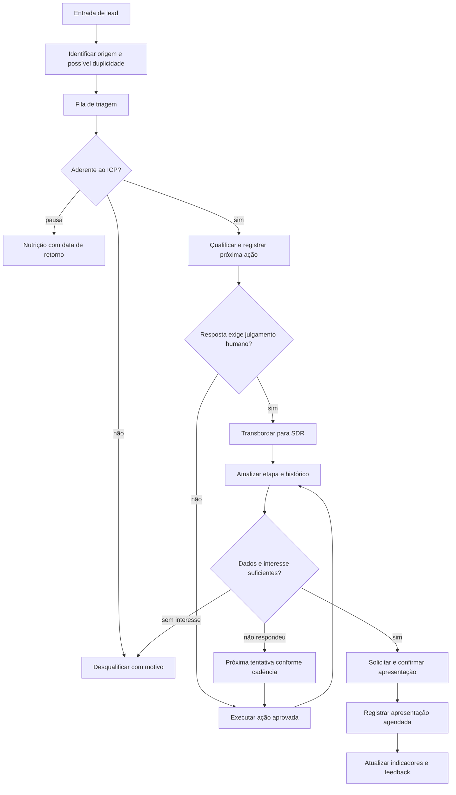

# Escopo Definitivo — Central de Aquisição e Qualificação de Leads

**Cliente:** Pontual Tecnologia  
**Processo:** aquisição, triagem, qualificação e encaminhamento de leads até o agendamento da apresentação comercial  
**Versão:** 1.0 — consolidação do escopo-base, mapeamentos, análises e reuniões de 11/08/2026 e 28/08/2026  
**Horizonte:** quatro meses, em cinco fases incrementais  
**Status:** escopo consolidado; decisões operacionais pendentes estão registradas na seção 10 e precisam ser homologadas antes das SPECs da fase correspondente.

> Este documento é o contrato funcional do projeto. Instruções operacionais presentes nas gravações — como conectar contas, criar repositório, instalar skills ou configurar o ambiente — são tarefas de setup e não constituem, por si só, requisitos de produto.

## 1. Resultado de negócio

A Pontual precisa recuperar previsibilidade na geração de oportunidades comerciais aderentes ao seu mercado: lojas de material de construção, ferragens e madeireiras que precisam de organização e controle operacional. O projeto entregará uma operação única e rastreável para:

1. receber leads de canais identificados;
2. evitar duplicidades e contatos indevidos;
3. triá-los e qualificá-los com apoio do sistema, mantendo a decisão comercial humana;
4. organizar contatos, follow-ups e exceções;
5. encaminhar leads qualificados para apresentação comercial;
6. medir quais origens e campanhas geram qualidade, não apenas volume.

O limite funcional do projeto é o **agendamento e registro da apresentação comercial**. Proposta, negociação final, assinatura, faturamento, implantação, suporte, CS, comissões e pós-venda ficam fora deste escopo.

### 1.1 Métrica de sucesso

As referências atuais são **20 leads qualificados/mês, 10 apresentações realizadas/mês e CPL qualificado ≤ R$ 200**, enquanto o mapa de processos registra **25 qualificados/mês, 8 apresentações/mês e CPLQ de R$ 160**. Como não houve homologação humana no material disponível, estas metas são **referências de planejamento, não critérios finais de aceite**.

Antes do aceite da fase que mede resultado, a Pontual deverá aprovar definição de lead, lead qualificado, apresentação agendada/realizada, janela de medição, fórmula do CPLQ, baseline histórico e meta única ou segmentada por produto/canal.

## 2. Usuários e responsabilidades

| Papel | Responsabilidade |
|---|---|
| SDR/Comercial | triagem, qualificação, contatos, follow-up e confirmação da apresentação |
| Gestão/Diretoria | acompanhar fila e indicadores; aprovar ICP, metas e mudanças |
| Marketing/agência | acompanhar origem/campanha e receber feedback de qualidade |
| Administrador | configurar etapas, campos, regras e mensagens aprovadas |
| Parceiros, como Hiper | consultar apenas dados da própria origem, se habilitado |
| Assistente/IA | sugerir, resumir, classificar preliminarmente e sinalizar transbordo |

Marcelo é o champion e ponto focal identificado nas reuniões. O RACI final precisa ser confirmado na homologação.

## 3. Escopo do produto

### 3.1 Capacidades incluídas

- cadastro único de empresa, contato e oportunidade;
- origem, campanha, canal e contexto de aquisição;
- detecção/sinalização de possível duplicidade;
- funil visual em Kanban, com histórico de mudanças;
- fila de triagem e próximas ações do SDR;
- ficha de qualificação consultiva e matriz de ICP por produto;
- estados padronizados e motivos de desqualificação, pausa, perda e recusa;
- registro de conversas e tentativas por canal;
- cadência configurável e bloqueio de novas ações após recusa;
- bases de prospecção, importação assistida e conciliação;
- solicitação e confirmação do agendamento, conforme regras homologadas;
- painel de aquisição, qualificação, agendamento e qualidade por origem;
- feedback periódico Marketing–Comercial;
- transbordo para humano quando a conversa sair do roteiro;
- configuração administrativa de etapas, campos, regras e mensagens;
- loops de análise e operação assistida nas fases 4 e 5, adicionais às capacidades de sistema.

### 3.2 Fluxo-alvo

### 3.3 Rotas de decisão

**Automação determinística:** registro de origem, deduplicação sinalizada, atualização de etapa, criação de próxima ação, alertas de atraso, supressão de recusas e cálculo de indicadores.

**Apoio de IA:** resumo do histórico, sugestão de resposta, classificação preliminar, recomendação de campanha e sinalização de transbordo. Toda saída precisa ser revisável e auditável.

**Humano obrigatório:** homologação do ICP, decisão de qualificado/desqualificado/nutrição, resposta a exceções, aprovação de mensagem/campanha, confirmação do agendamento, alteração de regras e aceite.

## 4. Requisitos funcionais

| ID | Requisito | Resultado observável |
|---|---|---|
| RF-001 | Registro único | Criar/localizar empresa, contato e oportunidade e sinalizar duplicidade sem apagar histórico. |
| RF-002 | Origem rastreável | Toda entrada possui origem; campanha/anúncio ficam registrados quando disponíveis. |
| RF-003 | Funil e fila | SDR visualiza etapa, prioridade, responsável, SLA e próxima ação. |
| RF-004 | Qualificação | Registrar segmento, região, sistema atual, regime tributário, abertura, usuários, produto e contexto. |
| RF-005 | Decisão humana | O sistema apoia, mas não decide sozinho a aderência ao ICP. |
| RF-006 | Estados e motivos | Novo, triagem, primeiro contato, qualificação, qualificado, desqualificado, nutrição, agendamento solicitado e agendado. |
| RF-007 | Cadência | Cada tentativa registra data, canal, resultado e próxima ação; estados finais interrompem a cadência. |
| RF-008 | Supressão | Recusa explícita bloqueia futuras ações elegíveis e mantém auditoria. |
| RF-009 | Transbordo | Baixa confiança ou pergunta fora do roteiro encaminha para humano e interrompe automação. |
| RF-010 | Bases | Importação assistida preserva origem, detecta duplicidade e dispensa transformação manual entre planilhas. |
| RF-011 | Agendamento | Registrar data, horário, responsável, participantes, produto e contexto. |
| RF-012 | Indicadores | Mostrar entradas, qualificados, desqualificados, motivos, agendamentos, tempos e conversões por origem/período. |
| RF-013 | Feedback | Comparar volume e qualidade por canal/campanha para Marketing e Comercial. |
| RF-014 | Administração | Configurar etapas, campos, regras e mensagens sem editar histórico. |
| RF-015 | Acesso/auditoria | Limitar acesso por papel e registrar mudanças críticas e ações automáticas. |

## 5. Dados, integrações e governança

Fontes citadas: Google Ads, Meta Ads, YouTube, MoveDesk/Zenvia, CRM Pontual, RespondeChat, WhatsApp, Excel/SharePoint, Google Sheets, Outlook/Gmail, Conexa e bases de parceiros. A existência de acesso ou conector mencionado na reunião não significa integração aprovada.

A fonte oficial ainda não foi decidida entre MoveDesk, CRM Pontual ou nova camada. O projeto começa com auditoria de campos, identificadores, permissões, exportação/importação e histórico; nenhuma migração integral ou substituição será presumida.

O primeiro corte usa **importação assistida de amostra anonimizada e uma integração prioritária**, escolhida após auditoria. APIs completas ficam fora do primeiro corte salvo decisão e viabilidade comprovadas.

Antes de qualquer envio integrado por WhatsApp ou outro canal, devem ser aprovadas elegibilidade, base legal, opt-out, retenção, auditoria, frequência, contingência e responsável. O MVP poderá registrar e suprimir contatos sem realizar envios automáticos.

## 6. Cinco fases

As cinco fases entregam incrementos do sistema. As fases 4 e 5 acrescentam loops/agentes; não substituem a entrega de sistema. A fase 5 também valida transversalmente tudo que foi entregue nas fases 1–5.

### Fase 1 — Núcleo visível de aquisição e triagem

**Resultado:** usuário autorizado acessa um cockpit inicial, importa uma amostra ou cadastra lead, visualiza Kanban, origem, ficha e próxima ação.

**Sistema incluído:** login e papéis mínimos; cadastro; origem; busca; possível duplicidade; Kanban; fila inicial; histórico; importação assistida de amostra; painel básico por origem.

**Fora da fase:** IA autônoma, envio automático, migração integral, substituição do CRM, ICP definitivo, campanhas complexas e agendamento integrado.

**Aceite:** criar/importar amostra sem duplicar registros conhecidos; alterar etapa e responsável; consultar origem/histórico; impedir edição de configuração por usuário sem permissão.

**Risco/rollback:** se identificadores ou fonte não forem confiáveis, interromper a migração e voltar à amostra; nenhum dado original é apagado.

### Fase 2 — Qualificação, cadência e agendamento operacional

**Resultado:** SDR recebe fila, conduz qualificação consultiva, registra decisão e solicita/confirma apresentação.

**Sistema incluído:** ICP por produto; estados e motivos; tentativas/canais/próxima ação; alertas; nutrição; supressão; solicitação e confirmação manual; reagendamento/cancelamento se homologados.

**Fora da fase:** classificação autônoma definitiva, disparo em massa, promessa de apresentação realizada e integração de WhatsApp/calendário sem política aprovada.

**Aceite:** demonstrar novo → triagem → qualificação → agendamento; recusa bloqueia nova ação; pausa cria retorno; cada tentativa tem evidência; dados insuficientes impedem avanço indevido.

### Fase 3 — Aquisição mensurável e feedback de Marketing

**Resultado:** gestão compara canais/campanhas pela qualidade entregue e devolve ao Marketing uma visão acionável.

**Sistema incluído:** painel por origem/campanha/período/etapa; taxa de qualificação/agendamento; tempo até primeiro contato; motivos; investimento informado ou integrado; CPLQ conforme fórmula aprovada; feedback periódico.

**Fora da fase:** ajuste automático de campanhas, orçamento automático, atribuição perfeita e decisão de investimento pela IA.

**Aceite:** reproduzir indicadores de registros conhecidos; filtrar por canal/período; identificar origem desconhecida; exportar devolutiva; apontar dados incompletos.

### Fase 4 — Operação assistida por campanhas, agentes e loops

**Incremento de sistema:** configurar campanhas e reativação por critérios, mensagens aprovadas, horário, elegibilidade e origem; administrar etapas/campos/regras pela interface; manter Kanban e histórico integrados.

**Loops/agentes adicionais:**

1. **Análise de aquisição:** recomendação semanal priorizada por campanha/origem, com evidência e ação sugerida; decisão final da gestão; não altera campanha automaticamente.
2. **Qualificação assistida:** classificação preliminar e sinalização de transbordo; amostra revisada pelo SDR; baixa confiança sempre vai para humano.
3. **Reativação:** seleção de negócios perdidos/nutrição elegíveis para campanha aprovada; a seleção é revisada antes de qualquer envio.

**Limites:** agente sugere, resume, etiqueta e cria tarefa; não muda ICP, qualifica definitivamente, envia mensagem, altera orçamento ou remove registro sem autorização.

**Aceite:** administrador cria regra sem editar código; agente explica evidência; transbordo pausa automação; recusados não entram na seleção; cada loop possui métrica, responsável e falha registrada.

### Fase 5 — Sistema integrado, loops amadurecidos e validação ponta a ponta

**Incremento de sistema:** consolidar fluxo até apresentação agendada, fechar integrações aprovadas, completar permissões/auditoria, estabilizar painel e entregar contingência.

**Loops/agentes:** amadurecer loops das fases 4–5 e medir baseline, alvo, cadência e confiabilidade; autonomia adicional exige aprovação específica.

**Validação transversal:**

| Cobertura | Evidência mínima |
|---|---|
| Fase 1 | login, papéis, cadastro/importação, origem, duplicidade, Kanban e histórico |
| Fase 2 | qualificação, motivos, cadência, recusa, nutrição e agendamento |
| Fase 3 | painel, filtros, cálculo, lacunas e feedback |
| Fase 4 | configuração, agentes, loops, transbordo, supressão e recuperação |
| Fase 5 | regressão completa, integração, privacidade, timeout, duplicidade, rollback e go-live |

**Aceite:** roteiro ponta a ponta com o champion; provas de permissões, integridade, privacidade, erros, timeout, duplicidade, recuperação e rollback; itens não testados permanecem pendentes; decisão humana de go-live/encerramento.

## 7. Fora de escopo global

- geração de demanda garantida pelo sistema;
- substituição integral do CRM sem auditoria e decisão formal;
- CRM 360º, pós-venda, implantação, suporte e CS;
- proposta, contrato, faturamento, cobrança, comissão e entrega do ERP;
- inteligência financeira/FP&A/DRE preditivo para clientes finais;
- disparo automático de WhatsApp/e-mail sem governança aprovada;
- decisão autônoma de ICP, orçamento, campanha, qualificação ou agendamento;
- migração integral antes da prova com amostra;
- integração com todos os canais por inferência;
- promessa de aumento de indicadores sem baseline e medição homologados.

## 8. Critérios globais de qualidade

- decisão comercial relevante tem autor, data e motivo;
- automação é idempotente, auditável e reversível quando aplicável;
- dados desconhecidos ficam explícitos;
- acesso segue papel e menor privilégio;
- recusa prevalece sobre campanhas e cadências;
- transbordo interrompe automação do caso;
- ausência de erro relatado não é evidência suficiente;
- cada SPEC deverá conter fluxo, dados, dependências, limites, exceções, TDD, checklist e aceite;
- nenhuma fase avança sem demonstração e aceite humano.

## 9. Riscos e respostas

| Risco | Resposta |
|---|---|
| Fonte oficial indefinida | auditoria + amostra + decisão antes da migração |
| ICP não homologado | matriz por produto e decisão humana no MVP |
| Cadência 3 versus 7 tentativas | parametrizar somente após regra aprovada |
| WhatsApp sem política | registro/supressão primeiro; envio só após governança |
| Baseline inconsistente | dicionário de eventos e janela histórica auditável |
| Captura não demonstrada | provar anúncio → captura antes da integração definitiva |
| Agendamento sem regra | definir calendário, participantes, confirmação e exceções |
| Escopo grande demais | entrega vertical por fase e limites explícitos |
| IA com baixa confiança | limiar, transbordo, revisão humana e logs |

## 10. Decisões pendentes para execução

1. **Fonte oficial:** MoveDesk, CRM Pontual ou nova camada.
2. **Meta e fórmula:** escolher entre as referências 20/10/R$200 e 25/8/R$160, ou registrar outra.
3. **Evento principal:** agendamento ou realização; o escopo operacional termina em agendamento.
4. **Cadência:** três, sete ou por origem/produto.
5. **WhatsApp no MVP:** integrar envio, registrar/suprimir sem envio ou deixar fora; padrão deste documento: registrar/suprimir sem envio.
6. **Integração prioritária:** uma, após auditoria da fonte e dos acessos.
7. **RACI, calendário, participantes, reagendamento, cancelamento e no-show.**
8. **Base legal, retenção e política de contato.**

## 11. Rastreabilidade resumida

| Fonte/achado | Decisão | Requisitos | Fase |
|---|---|---|---|
| Reunião: poucos leads aderentes e excesso de leads sem perfil | medir qualidade e melhorar triagem | RF-002, RF-004, RF-012, RF-013 | 1–3 |
| Reunião: dashboard Google/Meta e recomendações | painel primeiro; recomendação assistida depois | RF-012, RF-013 | 3–4 |
| Reunião: clone de WhatsApp e transbordo | operação assistida com humano obrigatório | RF-009, RF-015 | 2, 4–5 |
| Reunião: Kanban muda conforme conversa | estados e histórico determinísticos | RF-003, RF-006 | 1–2 |
| Reunião: configurar etapas/automação pela interface | administração controlada | RF-014 | 4–5 |
| Escopo-base: duplicidade e retrabalho em planilhas | amostra e registro único | RF-001, RF-010 | 1 |
| AC-002/AC-011 | fonte e migração não presumidas | RF-001, RF-015 | 1, 5 |
| AC-003/AC-007 | baseline e evento precisam definição | RF-012 | 3, 5 |
| AC-005/AC-006/AC-009 | ICP, WhatsApp e cadência com gate | RF-004, RF-007, RF-008 | 2, 4 |
| DMO/reuniões: FP&A/IA financeira | oportunidade futura | fora de escopo | futuro |

## 12. Próximos artefatos

As SPECs serão geradas em onda, uma fase por vez, começando pela Fase 1. Cada SPEC deverá detalhar comportamento de sistema, atores, permissões, dados, integrações, regras, exceções, recuperação, TDD, evidências e aceite. Loops das fases 4 e 5 deverão ter meta, baseline, alvo, unidade, prazo, cadência, fonte de medição, responsável pelo veredito, conectores, limites e recuperação.

O escopo fica **consolidado, mas com gate de homologação pendente** para as decisões da seção 10. O arquivo `04-Analise_do_Consultor (1).md` disponível estava sem respostas; por isso nenhuma decisão humana ausente foi apresentada como aprovada.

## 13. Fontes utilizadas

- `03-Projeto/01-Escopo.md` — escopo-base e fluxo to-be;
- `03-Projeto/00-DMO.md` — diagnóstico e contexto do negócio;
- `03-Projeto/02-Plano_de_acao/00-Analise_Critica/03-Analise_Critica (1).md` — achados AC-001 a AC-012;
- `03-Projeto/02-Plano_de_acao/00-Analise_Critica/04-Analise_do_Consultor (1).md` — template de decisões, sem respostas homologadas;
- atas, decisões e insights das reuniões de kickoff e sales call de 11/08/2026;
- transcrição fornecida da reunião de configuração e alinhamento, especialmente 40:24–50:13;
- vídeos e análises de mapeamento de processos referenciados no escopo-base.

**Não utilizados como requisitos:** instruções de instalação/configuração do ambiente, criação de repositório, conexão de contas e instalação de skills; esses itens são setup operacional.
