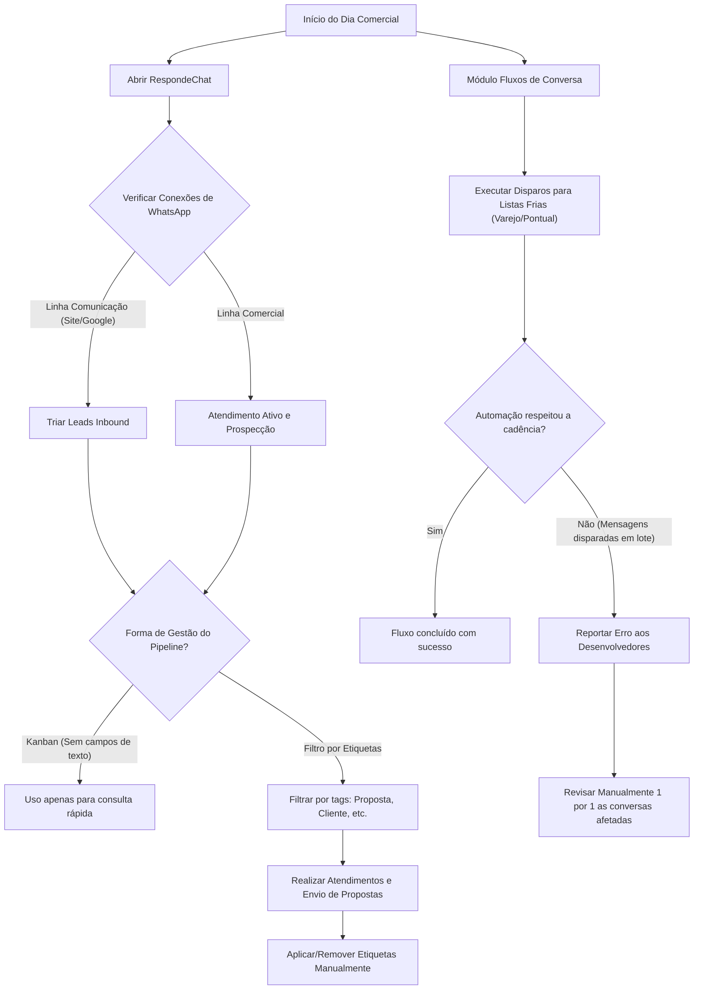

# Análise (IA) — Gravando 2026-08-25 105709.mp4-respondechat.mp4

**Vídeo:** Gravando 2026-08-25 105709.mp4-respondechat.mp4

**Processo:** Aquisição e qualificação de leads até o agendamento da apresentação comercial.

---

# RAIO-X INDIVIDUAL

**Empresa:** Pontual Tecnologia  
**Processo master:** Gestão Comercial, Prospecção de Leads e Atendimento Omnichannel  
**Vídeo:** Demonstração da ferramenta RespondeChat e fluxos operacionais  
**Executor:** Responsável pelo Setor Comercial (Lidiane Teixeira)  
**Duração:** 08:31  
**Data da gravação exibida na tela:** 25/08/2024  

### Resumo do Processo
* **Gatilho:** Abertura da rotina diária de atendimento e disparos de prospecção comercial.
* **Resultado:** Qualificação, triagem de leads, envio de propostas e cadência de contatos via WhatsApp.
* **Gargalo Principal:** Falha estrutural no motor de automação do `RespondeChat`, que dispara mensagens de cadência de forma simultânea (em lote) em vez de espaçadas, exigindo retrabalho manual para auditar contatos um a um.
* **Maior Oportunidade:** Migração/correção do motor de cadência e reestruturação de tags/CRM para eliminar conferências manuais em listas frias de até 100 contatos.

---

# 2. DESCRIÇÃO NARRATIVA DO SISTEMA (PARA LEIGO)

O sistema central utilizado é a plataforma web **`RespondeChat`** (acessível via `app.respondechat.ai`), um software de automação de mensagens integrado ao WhatsApp com recursos de CRM simples, construtor de fluxos (Flow Builder) e inteligência artificial.

### Interfaces e Estrutura de Telas
1. **Bate Papo ao vivo (WhatsApp):**
   * **Menu Lateral:** Apresenta atalhos para *Dashboard*, *Bate Papo ao vivo*, *WhatsApp*, *WA Oficial*, *Instagram*, *Widget Chat*, *Email*, *TikTok*, *Kanban's*, *IA*, *Fluxos de Conversa*, *Transmissão*, *Audiência* e *Configurações*.
   * **Conexões / Números Operacionais:** Existem duas linhas conectadas:
     * `Comercial`: Utilizada pela responsável comercial para prospecção ativa, agendamento de reuniões, apresentações e envio de propostas.
     * `Comunicação`: Linha principal de contato do site/Google (usada primariamente pelo setor Financeiro), mas que recebe *inbound leads* organicos que chegam pela web.
   * **Abas de Atendimento:** A tela de bate-papo divide-se em `Atendendo`, `Aguardando` e `Resolvido`.
   * **Filtros por Etiquetas (Tags):** Caixa de busca para filtrar conversas por tags específicas como `Proposta`, `Proposta Hiper`, `Lead - Prospecção`, `Cliente`, `Cliente ativo`, `Comercial`, `Hiper`, etc.

2. **Módulo Kanban:**
   * Apresenta quadros divididos por colunas operacionais (ex.: *Representantes*, *Contato com representante*, *Contato manual*, *Negociação*, *Perdido inatividade*, *Perdido c/ informações*, *Negociação Pausada*, *Prospectado*, *Agenda*, *Anúncio*).
   * **Regra de Uso/Limitação:** A usuária relata que não utiliza o Kanban como ferramenta principal de gestão porque o card do Kanban no `RespondeChat` não permite adicionar/visualizar notas de texto detalhadas sobre o histórico do contato. Por isso, prefere o filtro direto por Etiquetas dentro do chat.

3. **Módulo Fluxos de Conversa (Flow Builder):**
   * Interface visual gráfica estilo diagrama de blocos conectáveis.
   * **Blocos disponíveis no menu esquerdo:** *Conteúdo*, *Menu*, *Ação*, *Variável global*, *Randomizador*, *Condição*, *Atraso inteligente*, *Integração*, *OpenAI*.
   * **Regras de Negócio do Fluxo:** O fluxo `Prospecção Varejo - Hiper` inicia com envio de texto de apresentação (`Conteúdo`), aguarda um tempo programado (ex.: 30 a 50 segundos de simulação de digitação/espera), aplica uma `Ação` (adicionar etiqueta `Prospect Hiper`), direciona para um `Menu` de opções (com respostas alternativas para o cliente escolher), e encaminha o atendimento conforme a resposta selecionada.

---

# 3. MAPEAMENTO E FLUXO

### Tabela Passo a Passo

| # | Timestamp | Atividade | Responsável | Sistema/Ferramenta | Tipo | Tempo | VA/BVA/NVA | Observações |
|---|---|---|---|---|---|---|---|---|
| 1 | 00:00 | Apresentação do setor e introdução das ferramentas da rotina comercial | Comercial | RespondeChat | Ação | 00:29 | BVA | Início da rotina comercial diária. |
| 2 | 00:29 | Explicação sobre as duas conexões de WhatsApp (`Comercial` e `Comunicação`) | Comercial | RespondeChat | Ação | 01:10 | BVA | Leigos do site chegam na aba `Comunicação` e precisam de atenção contínua. |
| 3 | 01:39 | Apresentação do menu lateral do RespondeChat e atualizações recentes (IA integrada) | Comercial | RespondeChat | Ação | 01:01 | BVA | Explica custos adicionais por canal conectado (Instagram, TikTok, etc.). |
| 4 | 02:40 | Navegação e avaliação dos quadros Kanban (`Atendimento comercial/SDR` e `Hiper`) | Comercial | RespondeChat | Decisão | 00:44 | NVA | Identifica restrição do Kanban: falta de campos descritivos nos cards. |
| 5 | 03:24 | Aplicação e navegação por filtros de Etiquetas (`Etiquetas`) no chat ao vivo | Comercial | RespondeChat | Ação | 01:11 | VA | Localiza conversas em aberto filtrando pela tag `Proposta`. |
| 6 | 04:35 | Relato e verificação da falha de migração de dados de etiquetas nos contatos antigos | Comercial | RespondeChat / Banco de Dados | Espera / Correção | 01:06 | NVA | Perda de histórico de tags na migração ocorrida há 2 meses; obriga remarcação manual. |
| 7 | 05:41 | Acesso ao módulo `Fluxos de Conversa` e listagem de fluxos de disparos em lote | Comercial | RespondeChat | Ação | 01:10 | VA | Disparos semanais para listas frias (Varejo Hiper e Pontual/AutoMec/Climbe). |
| 8 | 06:51 | Abertura e inspeção do fluxo gráfico `Prospecção Varejo - Hiper` | Comercial | RespondeChat | Ação | 00:27 | BVA | Exibição da estrutura de nós do Flow Builder. |
| 9 | 07:18 | Explicação sobre falhas de execução no motor de cadência automatizada dos fluxos | Comercial | RespondeChat | Espera / Retrabalho | 01:05 | NVA | O sistema dispara todas as mensagens da cadência juntas em vez de aguardar dias. |
| 10 | 08:23 | Encerramento da demonstração do RespondeChat | Comercial | RespondeChat | Ação | 00:08 | BVA | Finalização do primeiro módulo do treinamento/operação. |

### Pontos de Decisão
* **03:24 — Gestão de Leads por Kanban vs. Etiquetas:** Condição: Se o Kanban não exibe notas/detalhes dos contatos `->` Caminho A: Abandonar uso operacional ativo do Kanban e gerenciar o pipeline via filtros de Etiquetas na tela de chat.
* **07:03 — Falha de execução do Fluxo:** Condição: Se o fluxo parar ou der erro de cadência `->` Caminho A: Utilizar a função "Assistente de IA" para tentar corrigir nós; Caminho B: Abrir chamado com desenvolvedores e fazer auditoria/retomada manual de cada conversa.

### Handoffs
* **00:54 (`01:00 - 01:15`):** Handoff de *Leads Inbound* do site/Google que chegam na linha `Comunicação` (usada pelo Financeiro) `->` Repassados para atendimento e triagem do setor Comercial.

### Regras de Negócio Implícitas
1. **[00:58] Regra de Atendimento Inbound:** Todo lead vindo de tráfego orgânico/Google entra pela linha `Comunicação` por estar configurada como número principal no site da empresa.
2. **[02:24] Regra de Custos por Integração:** Cada canal extra ativado no `RespondeChat` (Instagram, Widget, TikTok, etc.) gera cobrança adicional de assinatura por conexão.
3. **[04:35] Regra de Etiquetagem Manual Obrigatória:** Devido à falha de migração do banco de dados, todo atendimento iniciado deve ter suas etiquetas aplicadas manualmente do zero pelo operador.

### Exceções
* **Disparo com Quebra de Cadência (07:50):** Quando o sistema envia todas as mensagens de um fluxo de vários dias simultaneamente para o cliente, a operadora precisa parar o disparo, acionar os desenvolvedores do software e acessar manualmente até 100 conversas para reordenar/corrigir o atendimento.

### Diagrama de Fluxo (Mermaid)



---

# 4. DIAGNÓSTICO

### Tabela de Problemas Encontrados

| Timestamp | Problema | O que foi observado | Impacto | Severidade | Causa-raiz provável |
|---|---|---|---|---|---|
| 07:18 | Falha no motor de cadência de automação | O sistema envia todas as mensagens sequenciais de uma vez só em vez de aguardar os intervalos de dias programados. | Alto retrabalho manual (conferir até 100 contatos um por um), risco de bloqueio de número e insatisfação do lead. | **Crítica** | Bug/instabilidade de software no motor de execução do `RespondeChat`. |
| 04:35 | Perda de metadados/etiquetas em migração | Migração ocorrida há 2 meses transferiu contatos e mensagens, mas perdeu 90% das etiquetas atribuídas. | Perda de rastreabilidade de histórico comercial; necessidade de re-etiquetagem manual a cada interação. | **Alta** | Falha de script de migração/banco de dados do fornecedor da ferramenta. |
| 02:40 | Ineficiência do módulo Kanban | A tela de Kanban não permite inserir informações adicionais ou campos personalizados nos cards. | Abandono da funcionalidade de Kanban comercial nativa do software. | **Média** | Limitação de desenvolvimento da interface da ferramenta `RespondeChat`. |
| 00:54 | Desvio de entrada de Leads Inbound | Leads comerciais chegam no WhatsApp da `Comunicação` (usado pelo Financeiro) porque este número está no site. | Risco de atraso no tempo de primeira resposta ao lead (*Speed to Lead*). | **Média** | Configuração de canal/número no site desalinhada entre Comercial e Financeiro. |

* **Gargalo Principal DESTE processo:** A **instabilidade do motor de automação e cadência do `RespondeChat` (07:18)**. A ferramenta não garante o envio espaçado de mensagens em fluxos temporizados, anulando o benefício da automação e gerando retrabalho massivo de auditoria manual de listas de contatos.

### Oportunidades Óbvias
1. **Correção ou Troca da Ferramenta de Automação/CRM (Resolve 07:18 e 02:40):** Substituir o `RespondeChat` por uma plataforma de CRM/WhatsApp automatizado mais estável (ex.: ActiveCampaign, RD Station CRM, Zenvia, Evolvy) que possua cadência nativa funcional e Kanban personalizável. *Ganho estimado: Redução de ~30% no tempo gasto com retrabalho comercial.*
2. **Reconfiguração do Canal Inbound do Site (Resolve 00:54):** Redirecionar os botões de contato comercial do site diretamente para a conexão `Comercial`. *Ganho estimado: Eliminação de handoff e melhoria imediata no tempo de resposta.*
3. **Auditoria e Re-etiquetagem via Planilha/Exportação (Resolve 04:35):** Realizar atualização em massa de tags por importação de base (`Audiência`) em vez de recadastrar etiquetas manualmente a cada conversa individual. *Ganho estimado: Economia de tempo por atendimento.*

---

# 5. MÉTRICAS (BASELINE DESTE VÍDEO)

* **Lead Time Total do Treinamento/Demonstração:** 08:31 (observado).
* **Touch Time (Tempo de Ação Direta):** ~06:20 (estimado — tempo em que a usuária demonstra a navegação, explica configurações e simula filtros).
* **Tempo de Espera/Explicação Passiva:** ~02:11 (estimado — momentos de carregamento de tela e relato de problemas passados).
* **Tempo de Retrabalho Relatado:** High / Não quantificável em minutos exatos no vídeo, mas a usuária relata checar individualmente bases de até **100 contatos** quando ocorrem erros no fluxo (08:10).
* **Process Cycle Efficiency (PCE):** N/A (trata-se de um vídeo explicativo/demonstrativo do ecossistema de software).
* **Nº de Handoffs Observados:** 1 (Recebimento de leads da conexão `Comunicação`/Financeiro para a área Comercial).
* **Nº de Sistemas Distintos Citados/Exibidos:** 4 (RespondeChat, WhatsApp, Hiper, Pontual/AutoMec/Climbe).
* **Nº de Etapas Manuais:** 5 (Troca visual de conexões, filtragem manual por tags, re-etiquetagem de contatos, auditoria de contatos pós-erro de disparo, disparo manual de fluxos).

---

# 6. SINAIS PARA A CONSOLIDAÇÃO

* **Conexões prováveis com outros processos:**
  * Processo de Vendas do Sistema Hiper (Varejo).
  * Processo de Vendas de Sistemas Pontual (AutoMec / Climbe).
  * Processo Financeiro (devido ao compartilhamento da linha de WhatsApp `Comunicação`).
* **Processos citados mas não demonstrados:**
  * Processo de disparo e prospecção de parceiros/contadores ("Parceria Contador").
  * Processo de atendimento inbound do setor Financeiro.
  * Processo de suporte técnico / chamado junto aos desenvolvedores do RespondeChat.
* **Perguntas em aberto para o CS:**
  * Qual a taxa diária de falhas registradas nos disparos de fluxos de conversa?
  * Quantos leads entram por dia na linha `Comunicação` que precisam ser transferidos manualmente para a linha `Comercial`?

---

# 7. BLOCO DE DADOS ESTRUTURADO

```yaml
sistemas_citados: ["RespondeChat", "WhatsApp", "Hiper", "Pontual Tecnologia", "AutoMec", "Climbe"]
handoffs: [{de: "Financeiro / Comunicação", para: "Setor Comercial", item: "Leads Inbound recebidos pelo site", timestamp: "00:54"}]
gargalo_principal: "Falha de execução de cadência no RespondeChat enviando mensagens em lote e exigindo auditoria manual conversa por conversa"
conexoes_provaveis: ["Processo de Atendimento Financeiro", "Processo de Vendas Hiper", "Processo de Vendas AutoMec/Climbe"]
processos_citados_nao_mostrados: ["Atendimento Financeiro na linha Comunicação", "Prospecção de Parcerias com Contadores", "Abertura de chamados com suporte do software"]
perguntas_abertas_cs: ["Qual o volume de retrabalho semanal causado pela falha de cadência dos fluxos? — [INFERÊNCIA] em 08:10", "Existe plano de migração do RespondeChat para um CRM estruturado? — [INFERÊNCIA] em 02:40"]
metricas_baixa_confianca: ["Tempo exato de retrabalho em disparos de 100 contatos — estimado com base no relato em 08:10"]
```
