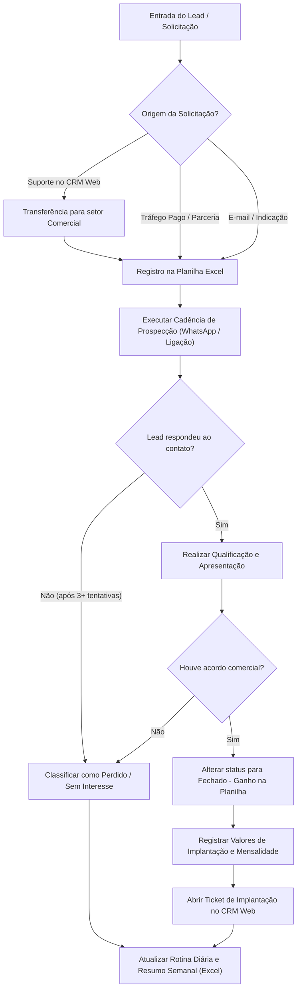

# Análise (IA) — Gravando 2026-08-25 110738.mp4-outrasferramentas.mp4

**Vídeo:** Gravando 2026-08-25 110738.mp4-outrasferramentas.mp4

**Processo:** Aquisição e qualificação de leads até o agendamento da apresentação comercial.

---

# RAIO-X INDIVIDUAL

**Empresa:** Pontual Tecnologia  
**Processo master:** Gestão Comercial, Prospecção e Atendimento de Leads  
**Vídeo:** Gravado em tela (demonstração de rotina comercial)  
**Executor:** Vendedora / Representante Comercial (Papel Comercial)  
**Duração:** 09:34  
**Data observada na tela:** 25/08/2026  

---

### Resumo Executivo
O processo compreende a recepção de atendimento/leads (via CRM Web, WhatsApp, E-mail e Tráfego Pago), o controle de cadência de prospecção/follow-ups e o acompanhamento de metas/atividades diárias. O gatilho primário é a entrada de solicitações de clientes ou o recebimento de novos leads comercializáveis; o resultado final é a conversão/fechamento da venda e abertura de tickets para implantação. O gargalo principal consiste na duplicação de controles (registro manual de etapas em planilha Excel paralela ao CRM Web). A maior oportunidade é centralizar a gestão do funil e das métricas operacionais diretamente no CRM Web, eliminando o preenchimento manual de planilhas de rotina.

---

## 2. Descrição Narrativa dos Sistemas (para leigo)

A operação demonstrada no vídeo utiliza três softwares/ferramentas principais acessados via navegador de internet:

### 1. CRM Pontual (`crm.nuvempontual.com`)
É a plataforma de atendimento multicanal e gestão de chamados da empresa, adotada recentemente (no mês corrente da gravação). 
* **Tela `Conversas` (`/conversas`):** Apresenta uma coluna lateral esquerda com a lista de conversas/tickets atribuídos ou em fila (`Minhas`, `Abertas`, `Pendentes`, `Sem fila`, `Todas`) e abas para filtro de conversas `Individuais` ou `Grupos`. No painel central, exibe o histórico de mensagens trocadas com o cliente (via WhatsApp integrado) e caixas para digitação de `Mensagem` ou `Comentário Interno`. No painel direito, exibe os detalhes do ticket ativo (`Ticket #654`, `SLA`, botões `Pausar inatividade`, `Pausar bot`, `Transferir`), dados do `CLIENTE` (`Nome`, `Telefone`, `E-mail`) e dados da `EMPRESA` (`Razão Social`, `CNPJ`, `Endereço`).
* **Menu lateral de navegação:** Possui ícones para `Painel de Atendimento` (`00:50`), `Painel` (geral), `Tickets`, `Dashboard`, `Contatos` (agenda de contatos com 255 cadastrados observada em `00:44`), `Empresas` e `Projetos` (`00:47`).
* **Regras de negócio observadas no CRM:** Atendimentos costumam entrar pelo setor de Suporte; caso o cliente solicite contratação de novos módulos/ferramentas, o chamado é transferido para o setor `Comercial`. O operador comercial realiza a negociação/envio de proposta e, ao concluir a entrega e homologação, finaliza o ticket. A ferramenta também permite abrir chamados internos para os setores de `Implantação`, `Desenvolvimento` e `Infraestrutura`.

### 2. Outlook Web (`Outlook.office.com`)
Cliente de e-mail corporativo utilizado como canal complementar de verificação e controle.
* **Componentes visíveis:** Caixa de entrada dividida entre `Destaques` e `Outros`. Painel de leitura de e-mails à direita.
* **Regras de negócio:** A vendedora realiza a conferência diária (prioritariamente no período da manhã) para acompanhar retornos de propostas assinadas, e-mails enviados pelo setor Financeiro (boletos/faturamento), atualizações de certificado digital e notificações do Google Ads (`Google Ads - ads-account-noreply@google.com`).

### 3. Planilha de Acompanhamento no SharePoint ("CRM - Acompanhamento - ok")
Planilha Excel hospedada em nuvem (`nuvempontual-my.sharepoint.com`), estruturada em conjunto com apoio externo (`[INFERÊNCIA]` - consultoria/estruturação comercial citada como "Vitória"). Contém as seguintes abas operacionais:

* **Aba `CRM - Funil de Vendas` (`02:28`):** Matriz de controle de leads e prospecção.
  * *Campos de identificação:* `Data Entrada`, `Nome Empresa`, `Informações do Lead (Contato / Decisor)`, `Tel / WhatsApp`, `E-mail`, `Segmento`, `Qualificação (Cidade/Bairro, Sistema Atual)`.
  * *Campos de origem e cadência:* `Fonte do Lead` (ex.: Tráfego pago, Indicação, Disparo Massivo), `1ª Tentativa`, `2ª Tentativa`, `3ª Tentativa`, `Última Interação`.
  * *Campos de funil e fechamento:* `ETAPA DO FUNIL` (menu suspenso com as opções: *Contatado*, *Fechado - ganho*, *Fechado - Perdido*, *Novo Lead*, *Perdido - Fechido*, *Proposta Enviada*, *Qualificado*, *Sem Interesse*), `Produto` (ex.: *Hiper gestão*, *Hiper Mini*), `Valor Proposta (R$)` (dividido em valor de implantação + mensalidade), `Data Fechamento`, `Observações` (campo livre para histórico textual das conversas).
* **Aba `Rotina Diária` (`06:16`):** Tabela de monitoramento de produtividade diária (com instrução de preenchimento até 18h).
  * *Campos:* `Data`, `Vendedor`, `Dia da Semana`, `PROSPECTAÇÃO ATIVA (WhatsApp Enviados, Ligações, Follow-up, Respostas)`, `REUNIÕES E VISITAS (Reuniões Agendadas, Reuniões Realizadas, Visitas Porta a Porta)`.
* **Aba `Resumo Semanal` (`06:33`):** Consolidação semanal dos indicadores com metas percentuais calculadas (`% Meta atingida`). Preenchida todas as sextas-feiras.
* **Aba `Leads Hiper - Trafego Pago` (`06:38`):** Tabela específica para prestação de contas dos leads gerados via campanha paga em parceria com o sistema "Hiper", compartilhada com a gerência do parceiro.
* **Abas de Planejamento Mensal (ex.: `Agosto` - `07:27`):** Grade de calendário semanal com colunas por dia da semana (`Segunda` a `Sexta`), onde são listadas manualmente as tarefas prioritárias do dia (ex.: reuniões, alinhamentos, prospecções, elaboração de *Playbook* comercial).

---

## 3. Mapeamento e Fluxo

| # | Timestamp | Atividade | Responsável | Sistema / Ferramenta | Tipo | Tempo Est. | VA/BVA/NVA | Observações |
|---|---|---|---|---|---|---|---|---|
| 1 | 00:00 - 00:20 | Apresentação inicial da aba de conversas do CRM Web | Papel Comercial | CRM Pontual (`/conversas`) | Ação | 00:20 | BVA | Explicação sobre o CRM em fase de alinhamento/adoção recente. |
| 2 | 00:20 - 00:43 | Verificação de chamados encaminhados pelo suporte/sistema | Papel Comercial | CRM Pontual (`/conversas`) | Ação | 00:23 | VA | Análise de solicitações de clientes que demandam atendimento comercial. |
| 3 | 00:44 - 00:49 | Navegação rápida pelas abas de Contatos e Projetos | Papel Comercial | CRM Pontual (`/contatos`, `/projetos`) | Ação | 00:05 | BVA | Demonstração do menu de contatos cadastrados e quadro de projetos. |
| 4 | 00:50 - 01:44 | Consulta ao Painel de Atendimento e detalhamento do Ticket #654 | Papel Comercial | CRM Pontual (`Painel de Atendimento`) | Ação / Espera | 00:54 | BVA | Visualização da fila da equipe por setor e detalhes do atendimento do cliente "Nyliane Kelly". |
| 5 | 01:45 - 02:26 | Conferência matinal da caixa de entrada de e-mails | Papel Comercial | Outlook Web | Ação | 00:41 | BVA | Leitura de notificações de propostas, boletos do financeiro e alertas do Google Ads. |
| 6 | 02:27 - 03:56 | Consulta e detalhamento da planilha "CRM - Funil de Vendas" | Papel Comercial | Planilha Excel (SharePoint) | Ação | 01:29 | NVA | Explicação do preenchimento manual de dados de identificação e qualificação dos leads. |
| 7 | 03:57 - 04:54 | Atualização/conferência de cadência e etapas do funil de vendas | Papel Comercial | Planilha Excel (SharePoint) | Decisão / Ação | 00:57 | BVA | Registro de tentativas de contato (1ª, 2ª, 3ª), seleção da etapa do funil e valores da proposta. |
| 8 | 04:55 - 05:35 | Leitura e digitação do histórico no campo "Observações" | Papel Comercial | Planilha Excel (SharePoint) | Ação | 00:40 | NVA | Anotação manual detalhada sobre o contexto das conversas e interações com o cliente. |
| 9 | 05:36 - 06:15 | Explicação do histórico de estruturação da planilha | Papel Comercial | Planilha Excel (SharePoint) | Ação | 00:39 | BVA | Relato sobre a transição de planilhas pulverizadas para uma planilha consolidada com apoio de "Vitória". |
| 10 | 06:16 - 06:36 | Apresentação das abas "Rotina Diária" e "Resumo Semanal" | Papel Comercial | Planilha Excel (SharePoint) | Ação | 00:20 | NVA | Apresentação dos lançamentos diários/semanais de volume de mensagens, ligações e visitas. |
| 11 | 06:37 - 07:17 | Demonstração da aba "Leads Hiper - Trafego Pago" | Papel Comercial | Planilha Excel (SharePoint) | Handoff / Ação | 00:40 | BVA | Exibição de aba compartilhada com parceiro externo (gerência da Hiper) para prestação de contas. |
| 12 | 07:18 - 07:25 | Transição rápida pelas abas de KPIs e planejamento passado | Papel Comercial | Planilha Excel (SharePoint) | Ação | 00:07 | BVA | Passagem rápida pelas abas `KPIs Junho` e `Julho`. |
| 13 | 07:26 - 09:34 | Planejamento semanal/diário de tarefas e elaboração do Playbook | Papel Comercial | Planilha Excel (SharePoint) | Ação / Decisão | 02:08 | VA | Detalhamento da agenda de trabalho da semana (24 a 28/08), reunião de liderança e projeto do Playbook Comercial. |

---

### Pontos de Decisão
* **00:26:** O cliente recebido via Suporte demanda novo produto/serviço? 
  * *Sim:* Atendimento é transferido/assumido pelo setor Comercial (`Comercial`).
  * *Não:* Mantém-se no Suporte/Outro setor.
* **04:18:** Qual o status atual do lead na prospecção?
  * *Sem resposta após várias tentativas:* Marcar como `Perdido - Fechido` ou `Sem Interesse`.
  * *Em negociação/apresentação agendada:* Manter como `Contatado` / `Proposta Enviada`.
  * *Contrato fechado:* Alterar para `Fechado - ganho`, preencher valores de implantação/mensalidade e abrir ticket interno de implantação.

### Handoffs
* **Interno (CRM Pontual):** Transferência de chamados do Suporte para o Comercial; e do Comercial para Implantação/Infraestrutura/Desenvolvimento (`00:40`).
* **Interno (Gestão/Diretoria):** Reunião semanal de alinhamento comercial com "Marcelo" (segundas-feiras às 09:00 / 11:00 - `07:44`).
* **Externo (Parceiro Hiper):** Planilha compartilhada na aba `Leads Hiper - Trafego Pago` onde a gerência da Hiper visualiza os retornos dos leads indicados (`07:08`).

### Regras de Negócio Implícitas
* **Registro de Cadência (`05:04`):** O padrão mínimo de contato envolve 3 tentativas (via WhatsApp e ligação intercalados) antes de classificar um lead como perdido.
* **Fechamento Mensal (`09:21`):** A última semana de cada mês é prioritariamente dedicada ao fechamento de propostas em aberto e negociações em andamento para atingimento de metas.
* **Rotina diária de e-mails (`01:46`):** Conferência obrigatória da caixa de entrada pela manhã.

### Exceções
* **Clientes de indicação direta (`03:33`):** Pulam etapas do tráfego pago e entram com cadência diferenciada no funil de vendas.

---

### Fluxograma do Processo (Mermaid)



---

## 4. Diagnóstico

### Tabela de Problemas Encontrados

| Timestamp | Problema | O que foi observado | Impacto | Severidade | Causa-raiz provável |
|---|---|---|---|---|---|
| 02:27 - 06:15 | Duplicidade de controles (CRM Web vs. Planilha Excel) | A operadora utiliza o CRM Pontual para chats e a planilha Excel para controlar o funil, cadência e histórico de prospecção. | **Alto:** Retrabalho de digitação, risco de dessincronização de dados e perda de eficiência temporal. | Alta | CRM Web adotado recentemente ainda não está parametrizado para gerenciar todas as etapas de pipeline e automações de cadência. |
| 06:16 - 06:36 | Lançamento manual de métricas operacionais | O número de mensagens enviadas, ligações e follow-ups é contado e digitado manualmente na aba "Rotina Diária". | **Médio:** Erro humano na contagem, tempo desperdiçado em tarefas administrativas sem valor agregado. | Média | Falta de dashboard automatizado integrado às ferramentas de telefonia e WhatsApp. |
| 07:27 - 09:05 | Gestão de tarefas em planilha sem alertas/notificações | O planejamento diário/semanal de tarefas atua como uma agenda estática em formato de grade no Excel. | **Baixo/Médio:** Falta de lembretes automáticos para tarefas críticas e dificuldade no acompanhamento de pendências em tempo real. | Média | Ausência de uso de uma ferramenta de gestão de tarefas (ex.: Planner, Trello ou o módulo Projetos do próprio CRM). |

---

### Gargalo Principal (Teoria das Restrições)
O gargalo principal deste processo é a **alimentação e atualização manual da Planilha de Acompanhamento Comercial no SharePoint**. Toda a inteligência do funil, os registros de tentativa de contato, observações textuais extensas e contagem de atividades dependerem da digitação manual da operadora na planilha Excel, consumindo parcela significativa da sua jornada diária (Touch Time produtivo convertido em trabalho administrativo NVA).

### Oportunidades Óbvias de Melhoria
1. **Migração do Funil de Vendas para o CRM Pontual (`02:27`):** Configurar os pipelines de vendas diretamente no CRM Web (aproveitando os recursos de tickets/quadros já visíveis na ferramenta), eliminando completamente a planilha `CRM - Funil de Vendas`.
2. **Automação do Registro de Atividades Diárias (`06:16`):** Extrair o volume de mensagens e chamadas diretamente dos relatórios/logs do CRM e sistema de telefonia, dispensando o preenchimento manual da aba `Rotina Diária`.
3. **Adopção do Módulo de Projetos/Tarefas do CRM (`07:27`):** Migrar a grade de planejamento semanal (aba `Agosto`) para a aba `Projetos` ou `Painel` já existente no CRM Pontual (`00:47`), garantindo notificações e acompanhamento de status.

---

## 5. Métricas (Baseline deste Vídeo)

* **Lead Time total do vídeo:** 09:34 (Demonstração gravada).
* **Touch Time observado:** ~09:34 (Operadora interagindo continuamente com os sistemas e apresentando as ferramentas).
* **Tempo de espera (Wait Time):** 00:00 (Vídeo contínuo de demonstração).
* **Tempo de retrabalho estimado (projeção rotineira):** `~30-45 min/dia` `[ESTIMADA]` — baseado no tempo necessário para digitar observações textuais manuais (`04:55`), contar interações e preencher a aba `Rotina Diária` (`06:16`) ao final do expediente.
* **Process Cycle Efficiency (PCE):** 100% (durante a demonstração); em operação real estimada em `~60%` devido ao volume de carga administrativa manual (NVA/BVA).
* **Número de handoffs visíveis:** 3 (Suporte -> Comercial; Comercial -> Implantação; Comercial -> Gerência Hiper).
* **Número de sistemas distintos em uso:** 3 (CRM Pontual, Outlook Web, Excel/SharePoint).
* **Número de etapas manuais de inserção de dados:** 8+ (Digitação de CNPJ, Contato, Telefone, Tentativas de Contato, Status do Funil, Valores, Observações e Lançamento de métricas diárias).

---

## 6. Sinais para a Consolidação

### Conexões Prováveis com Outros Processos
* **Processo de Suporte ao Cliente:** Origem dos chamados de clientes ativos que solicitam novos módulos/produtos.
* **Processo de Implantação:** Destino dos tickets fechados (`Fechado - ganho`) para configuração e homologação do software no cliente.
* **Processo Financeiro:** Interface via e-mail para emissão de boletos, faturamento e verificação de pagamento de implantações.

### Processos Citados, Mas Não Demonstrados
* Fluxo de envio e assinatura de propostas comerciais ("Autentique" / envio de documentos citados em `01:05` e `02:10`).
* Reunião semanal de alinhamento com a Liderança/Diretoria (segundas-feiras às 11:00 - `08:12`).
* Treinamento e integração de novos vendedores via "Playbook Comercial" (em fase de elaboração - `08:23`).

### Perguntas em Aberto para o CS
1. O CRM Pontual possui funcionalidade nativa de Funil de Vendas (Kanban comercial) habilitada para o perfil do usuário comercial? `[INFERÊNCIA em 00:20 / 02:27]`
2. A planilha compartilhada com a gerência do parceiro Hiper pode ser substituída por um relatório/dashboard exportável do CRM? `[NÃO OBSERVÁVEL em 07:08]`

---

## 7. Bloco de Dados Estruturado (YAML)

```yaml
sistemas_citados: ["CRM Pontual", "Outlook Web", "Planilha CRM - Acompanhamento - ok"]
handoffs: 
  - {de: "Suporte", para: "Comercial", item: "Chamado de cliente solicitando novo produto", timestamp: "00:26"}
  - {de: "Comercial", para: "Implantação", item: "Ticket de contratação de sistema fechado", timestamp: "00:40"}
  - {de: "Comercial", para: "Gerência Hiper", item: "Planilha compartilhada de retorno de leads", timestamp: "07:08"}
gargalo_principal: "Atualização e digitação manual extensiva de dados de prospecção, cadência e histórico na planilha Excel do SharePoint."
conexoes_provaveis: ["Processo de Atendimento de Suporte", "Processo de Implantação de Sistemas", "Processo Financeiro / Faturamento"]
processos_citados_nao_mostrados: ["Elaboração e Assinatura de Propostas (Autentique)", "Reunião Semanal de Liderança", "Execução do Treinamento via Playbook Comercial"]
perguntas_abertas_cs: 
  - "O CRM Pontual já possui módulo de pipeline comercial nativo configurado para dispensar o uso do Excel? — [INFERÊNCIA em 02:27]"
  - "Como é feito o controle de acesso de parceiros externos aos dados de leads no CRM? — [NÃO OBSERVÁVEL em 07:08]"
metricas_baixa_confianca: 
  - "Tempo de retrabalho diário com preenchimento de planilha estipulado em ~30-45 min/dia baseou-se na estimativa da rotina descrita pela operadora."
```
