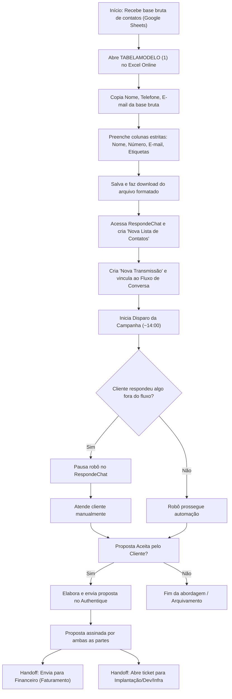

# Análise (IA) — Gravando 2026-08-25 115140.mp4-basesdecontatos.mp4

**Vídeo:** Gravando 2026-08-25 115140.mp4-basesdecontatos.mp4

**Processo:** Aquisição e qualificação de leads até o agendamento da apresentação comercial.

---

# RAIO-X INDIVIDUAL

**Empresa:** Pontual Tecnologia  
**Processo master:** Comercial / Gestão de Propostas e Prospecção Ativa  
**Vídeo:** video_0.mp4  
**Executor:** Consultora Comercial (Lidiane Teixeira)  
**Duração:** 05:39  
**Data:** `[NÃO OBSERVÁVEL]`  

---

### Resumo Executivo
O vídeo demonstra a gestão de propostas no Authentique, o controle de clientes revenda no Hiper/Hiperador e a rotina de montagem e acompanhamento de disparos de prospecção ativa no RespondeChat. O principal gargalo operacional é a manipulação manual e repetitiva de planilhas para formatar listas de contatos no modelo estrito do RespondeChat, aliada ao monitoramento manual necessário durante os disparos automatizados. A maior oportunidade reside na integração direta via API/Webhook entre a base de contatos e a plataforma de disparo para eliminar a formatação manual em Excel.

---

## 2. Descrição narrativa do sistema (para leigo)

O processo utiliza quatro sistemas principais integrados de forma manual pela operadora:

1. **Authentique (`painel.authentique.com.br/documentos/organizacao`)**: É a plataforma de gestão e formalização digital de propostas comerciais. A tela exibe cartões com propostas organizadas pelo menu `Toda a organização`. Cada cartão exibe o título da proposta (ex.: `1226 CD - Proposta BSC`), data de criação, status dos assinantes (`Assinou`, `Aguardando`) e os nomes dos signatários (cliente e representantes da Pontual Tecnologia). Ao ser assinada pelo cliente e pela contratante, a proposta é considerada formalizada, servindo de gatilho interno para faturamento no setor financeiro e para abertura de chamados/tickets para as equipes operacionais de Implantação, Desenvolvimento ou Infraestrutura.

2. **Hiper / Hiperador (`portal.hiper.com.br/Home/Index`)**: É o portal de gestão da revenda de sistemas de varejo (software Hiper). A tela principal possui um painel com métricas de clientes ativos, nível de parceria (`Prata`), notificações, materiais de marketing e menu lateral com seções como `Pendências`, `CRM`, `Clientes`, `Pedidos`, `Relatórios` e `Financeiro`. Na aba `Clientes` -> `Banco de cadastros`, a tela exibe uma listagem com os campos: `Código`, `Cliente`, `Cidade - UF`, `Cliente desde`, `Tipo`, `Status` e `Custo mensal`. Permite controlar contratos ativos e informações financeiras dos clientes da revenda.

3. **Base de Contatos Lidi (Google Sheets) & TABELAMODELO (1) (OneDrive / Excel Online)**:
   - *Base de Contatos Lidi (Google Sheets)*: Planilha com dados brutos de prospecção fornecida pela parceira (Vitória / Hiper). Contém colunas como `cnpj`, `razaosocial`, `nomefantasia`, `dataAbertura`, `situacaoCadastral`, endereço, telefone e e-mail.
   - *TABELAMODELO (1) (Excel Online)*: Modelo padronizado exigido para importação no RespondeChat. Possui exatamente 4 colunas obrigatórias: `Nome` (Coluna A), `Número` (Coluna B), `E-mail` (Coluna C) e `Etiquetas` (Coluna D, ex.: `Prospect Hiper`). A regra de negócio exige que apenas contatos limpos e formatados estritamente sob essa estrutura sejam salvos e importados no sistema de chat.

4. **RespondeChat (`app.respondechat.ai`)**: Plataforma de automação de mensagens via WhatsApp. A tela possui menus para `Fluxos de Conversa` (onde são criados os bots/roteiros de atendimento), `Transmissões` (onde são criadas e executadas as campanhas de disparo em massa) e `Lista de Contatos`. Para realizar um disparo, a regra do sistema exige a seleção prévia de uma `Lista de Contatos` importada no formato correto e a vinculação a um fluxo pré-criado. Durante a execução do disparo automatizado, caso o lead envie uma resposta que não esteja prevista na árvore do robô (ex.: questionando a origem do contato), o executor deve intervir manualmente, pausando a automação para aquele contato específico e realizando o atendimento humano.

---

## 3. Mapeamento e fluxo

### Tabela de Passo a Passo

| # | Timestamp | Atividade | Responsável | Sistema/Ferramenta | Tipo | Tempo | VA/BVA/NVA | Observações |
|---|---|---|---|---|---|---|---|---|
| 1 | 00:00 | Apresentação da ferramenta Authentique e fluxo pós-assinatura de proposta | Consultora Comercial | Authentique (`painel.authentique.com.br`) | Ação | 00:51 | BVA | Mostra proposta assinada `1226 CD - Proposta BSC` e detalha handoff interno para financeiro e implantação. |
| 2 | 00:52 | Alternância de aba para SharePoint/OneDrive | Consultora Comercial | Navegador Web | Espera | 00:09 | NVA | Transição visual de tela aguardando próxima etapa. |
| 3 | 01:01 | Apresentação do portal Hiperador e consulta ao Banco de Cadastros | Consultora Comercial | Hiper / Hiperador (`portal.hiper.com.br`) | Ação | 00:51 | BVA | Mostra painel de controle de clientes revendidos e abas de relatórios/financeiro. |
| 4 | 01:53 | Exibição da planilha bruta de contatos de prospecção | Consultora Comercial | Google Sheets (`Base de contatos Lidi`) | Ação | 00:27 | BVA | Planilha enviada por parceira (Vitória) com dados cadastrais brutos. |
| 5 | 02:20 | Explicação da restrição de importação de listas no RespondeChat | Consultora Comercial | RespondeChat (`app.respondechat.ai`) | Ação | 01:10 | NVA | Explica que a plataforma exige um layout rígido de importação e tags preexistentes no fluxo. |
| 6 | 03:31 | Demonstração da limpeza e formatação manual dos dados no template Excel | Consultora Comercial | OneDrive / Excel Online (`TABELAMODELO (1)`) | Ação | 00:56 | NVA | Necessidade de copiar dados da base bruta, colar no template de 4 colunas, ajustar tags, salvar e baixar. |
| 7 | 04:27 | Importação da lista e criação da campanha de transmissão no RespondeChat | Consultora Comercial | RespondeChat (`app.respondechat.ai`) | Ação | 00:30 | BVA | Abertura do modal `Criar nova transmissão`, seleção da lista e do fluxo correspondente. |
| 8 | 04:57 | Monitoramento em tempo real do disparo e intervenção humana manual | Consultora Comercial | RespondeChat (`app.respondechat.ai`) | Ação / Decisão | 00:42 | NVA | Disparos realizados habitualmente às 14:00. Exige acompanhamento ativo para pausar o bot quando o lead faz perguntas fora do fluxo. |

---

### Detalhamento Complementar

* **Pontos de Decisão:**
  * **05:07 - Resposta do lead fora do fluxo automatizado?**
    * *Sim:* Pausar robô no RespondeChat e assumir chat manualmente para responder o cliente.
    * *Não:* Manter robô executando o fluxo automatizado de prospecção.

* **Handoffs:**
  * **00:27 - 00:45:** Proposta Assinada no Authentique → Setor Financeiro (para faturamento do sistema/implantação) e Setor de Operações (abertura de ticket para Implantação, Desenvolvimento ou Infraestrutura).
  * **01:59:** Vitória (Parceira Hiper) → Consultora Comercial (envio periódico da planilha bruta de contatos em Google Sheets).

* **Regras de Negócio Implícitas:**
  * `[RN-01]` `00:15` Propostas comerciais só são liberadas para faturamento/implantação após constar a assinatura formal do cliente e do representante legal da Pontual Tecnologia no Authentique.
  * `[RN-02]` `03:50` O RespondeChat recusa arquivos CSV/Excel que contenham colunas extras ou divergentes do padrão estrito: Coluna A (`Nome`), Coluna B (`Número`), Coluna C (`E-mail`), Coluna D (`Etiquetas`).
  * `[RN-03]` `04:05` A tag preenchida na Coluna D do Excel precisa obrigatoriamente corresponder à etiqueta de entrada configurada previamente no fluxo de conversa do RespondeChat.
  * `[RN-04]` `04:55` Os disparos de prospecção ativas para listas frias são programados preferencialmente no período da tarde (~14:00) para otimizar taxa de resposta.

* **Exceções:**
  * `05:09` **Questionamento sobre origem do contato:** Quando o cliente pergunta "Onde você conseguiu meu contato?", o bot não possui resposta cadastrada. A executora precisa identificar a mensagem em tempo real, pausar a automação no RespondeChat e responder manualmente.

---

### Diagrama de Processo (Mermaid)



---

## 4. Diagnóstico

### Tabela de Problemas Encontrados

| Timestamp | Problema | O que foi observado | Impacto (tempo/qualidade/risco) | Severidade | Causa-raiz provável |
|---|---|---|---|---|---|
| 03:31 | Manipulação manual e repetitiva de planilhas (ETL manual) | A operadora precisa filtrar, copiar e colar dados de uma planilha bruta para um modelo Excel específico toda semana. | Perda de ~30-45 min semanais; alto risco de erro na colagem de números/telefones. | Alta | Inexistência de script de conversão de dados ou integração via API entre as ferramentas. |
| 02:45 | Limitação da ferramenta de automação (RespondeChat) | O RespondeChat não aceita importação direta de arquivos fora do seu padrão ou integração nativa simplificada com planilhas de terceiros. | Requer criação contínua de novas listas e templates manuais. | Média | Arquitetura rígida de importação de contatos do RespondeChat. |
| 05:07 | Necessidade de monitoramento ostensivo e interrupção do trabalho | A operadora precisa parar suas tarefas principais durante o disparo para monitorar se o robô travará com perguntas não previstas. | Quebra de foco/produtividade (context switching); retrabalho em tempo de disparo. | Média | Fluxo do chatbot (árvore de decisão) incompleto para tratar objeções comuns de prospecção fria. |

* **Gargalo principal DESTE processo:**  
  O gargalo está na **preparação manual das listas de prospecção (ETL manual em Excel)** entre 03:31 e 04:27. A necessidade de adaptar manualmente a base bruta recebida para a `TABELAMODELO (1)` a cada nova campanha consome tempo operacional qualificado e limita o volume de contatos prospectados por semana.

* **Oportunidades óbvias:**
  1. **Automação da formatação da lista (Power Query ou Script Python/Google Apps Script):** Criar uma rotina simples que leia a planilha da parceira no Google Sheets e gere automaticamente o arquivo CSV no layout exato exigido pelo RespondeChat (timestamp 03:31). *Ganho: Eliminação de 100% do tempo de cópia/colagem manual.*
  2. **Aprimoramento do Fluxo do Chatbot:** Incluir nós de resposta automática para perguntas frequentes de prospecção fria (ex.: "Onde pegou meu contato?") dentro do RespondeChat (timestamp 05:07). *Ganho: Redução de intervenções manuais em tempo real e eliminação da necessidade de pausar o bot.*
  3. **Integração Authentique → CRM/Financeiro via Webhook:** Automatizar a notificação ao financeiro e a criação de tickets de implantação assim que uma proposta atinge o status `Assinado` no Authentique (timestamp 00:27). *Ganho: Redução do tempo de atendimento pós-venda (Lead Time de faturamento).*

---

## 5. Métricas (baseline deste vídeo)

* **Lead Time total do trecho demonstrado:** `~05:39` (tempo do vídeo cobrindo a explicação completa dos 3 ecossistemas).
* **Touch time (tempo de trabalho ativo da operadora na tarefa de montagem/disparo por ciclo):** `~15 a 20 min` por campanha `[ESTIMADO com base no relato de 03:20-04:25 sobre montar listas semanalmente]`.
* **Tempo de espera:** `~0` durante o vídeo (telas carregaram rapidamente).
* **Tempo de retrabalho:** `~01:00` por ciclo de importação (apagar linhas antigas do template Excel, colá-las novamente e reetiquetar).
* **Process Cycle Efficiency (PCE):** `~40%` `[ESTIMADO: Tempo de montagem ativa/envio efetivo sobre o tempo total gasto com tratamento de planilha e monitoramento no disparo]`.
* **Nº de handoffs:** 3 observados/citados (Vitória → Comercial; Comercial → Financeiro; Comercial → Implantação/Dev).
* **Nº de sistemas distintos:** 4 sistemas (`Authentique`, `Hiper/Hiperador`, `Google Sheets/OneDrive`, `RespondeChat`).
* **Nº de etapas manuais:** 6 etapas (Copiar dados brutos, colar no template, aplicar tag, salvar/baixar file, subir no RespondeChat, pausar bot manualmente em exceções).

---

## 6. Sinais para a consolidação

* **Conexões prováveis com outros processos:**
  * Processo de Gestão Financeira / Faturamento (recebe o gatilho da proposta assinada do Authentique e os dados de cliente do Hiperador).
  * Processo de Implantação / Suporte Técnico (recebe o ticket gerado pós-venda).
* **Processos citados mas não demonstrados:**
  * Abertura de ticket/chamado para Implantação, Desenvolvimento ou Infraestrutura (citado em 00:43).
  * Envio da fatura/cobrança pelo setor financeiro (citado em 00:28).
* **Perguntas em aberto para o CS:**
  * Qual o volume semanal exato de contatos prospectados via RespondeChat? — `[INFERÊNCIA]` baseado nas planilhas mostradas contendo cerca de 50 a 140 contatos por lote (`02:47`).
  * As propostas do Authentique são geradas automaticamente a partir de um CRM ou preenchidas manualmente? — `[NÃO OBSERVÁVEL em 00:10]`.

---

## 7. Bloco de dados estruturado

```yaml
sistemas_citados: ["Authentique", "Hiper", "Hiperador", "Google Sheets", "OneDrive", "Excel Online", "RespondeChat"]
handoffs: 
  - {de: "Vitória (Hiper)", para: "Consultora Comercial", item: "Base de contatos brutos de prospecção", timestamp: "01:59"}
  - {de: "Consultora Comercial", para: "Setor Financeiro", item: "Proposta formalizada assinada no Authentique", timestamp: "00:27"}
  - {de: "Consultora Comercial", para: "Setor de Implantação / Dev / Infra", item: "Ticket de abertura de projeto/serviço", timestamp: "00:43"}
gargalo_principal: "Formatação manual e repetitiva de planilhas de contatos (ETL manual) para adequação ao template do RespondeChat."
conexoes_provaveis: ["Processo de Faturamento Financeiro", "Processo de Implantação e Suporte Técnico"]
processos_citados_nao_mostrados: ["Abertura de ticket no setor de implantação/infra", "Faturamento e emissão de cobrança pelo setor financeiro"]
perguntas_abertas_cs:
  - "Qual o volume semanal médio de contatos formatados e disparados no RespondeChat? — [INFERÊNCIA em 02:47]"
  - "Como é feita a criação da proposta inicial antes do envio ao Authentique? — [NÃO OBSERVÁVEL em 00:10]"
metricas_baixa_confianca:
  - "PCE de 40% estimado com base no relato verbal sobre a frequência e duração da montagem de listas manuais."
```
