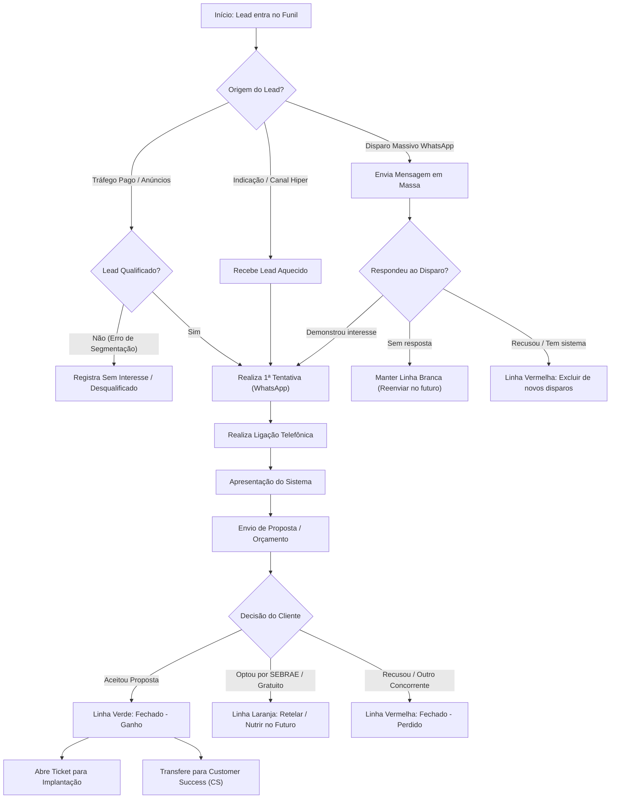

# Análise (IA) — Gravando 2026-08-25 153417.mp4-CRM2.mp4

**Vídeo:** Gravando 2026-08-25 153417.mp4-CRM2.mp4

**Processo:** Aquisição e qualificação de leads até o agendamento da apresentação comercial.

---

Aqui está o relatório completo de auditoria operacional do processo apresentado no vídeo, estruturado estritamente segundo as diretrizes de análise Lean/BPM.

---

# RAIO-X INDIVIDUAL

```
RAIO-X INDIVIDUAL
Empresa: Pontual Tecnologia [INFERÊNCIA: domínio da URL diane_pontualtecnologia_com_br]
Processo master: Gestão Comercial, Qualificação de Leads e Operação de CRM
Vídeo: CRM - Acompanhamento - ok.xlsx · Executor: Vendedora / Operadora Comercial (SDR / Fechadora) · Duração: 06:06 · Data: 24/08/2026 [Conforme relógio da tela em 00:00]
```

**Resumo Executivo:**
O processo engloba o recebimento, qualificação, registro e acompanhamento de contatos comerciais (leads) gerados por Tráfego Pago, Indicadores, Disparo Massivo via WhatsApp e Canais parceiros (ex.: Hiper). A executora opera manualmente uma planilha no Microsoft Excel Online (SharePoint), utilizando um código informal de cores nas linhas para gerenciar o funil de vendas (do primeiro contato por WhatsApp/Ligação até o fechamento e handoff para Implantação e CS).
* **Gargalo Principal:** Operação 100% manual em planilha aberta, dependente do critério de uso de cores da executora e sem automação de qualificação de entrada (leads desqualificados chegam diretamente à vendedora).
* **Maior Oportunidade:** Implementação de uma ferramenta dedicada de CRM integrada ao WhatsApp e às campanhas de anúncios, eliminando preenchimento e formatação manual de linhas.

---

## 2. Descrição Narrativa do Sistema (para leigo)

O processo utiliza a ferramenta **Microsoft Excel Online (SharePoint)**, em um arquivo nomeado **`CRM - Acompanhamento - ok`**. O arquivo contém diversas abas na parte inferior: **`CRM - Funil de Vendas`** (aba ativa no vídeo), **`Rotina Diária`**, **`Resumo Semana`**, **`Leads Hiper - Tráfego Pago`**, **`KPIs Junho`**, **`Julho`**, **`Agosto`**, entre outras.

A planilha funciona como a única base de dados comercial da empresa e organiza os registros linha a linha, com as seguintes colunas visíveis:
1. **`Data Entrada`**: Data de chegada do lead no sistema (ex.: `10/07/2026`, `14/07/2026`).
2. **`Nome Empresa`**: Razão Social ou Nome Fantasia da empresa prospecção/cliente (ex.: `KIDS MARKET COMERCIO DE GENEROS ALIMENTICIOS LTDA`).
3. **`Informações do Lead`**: Subdividida em `Contato / Decisor` (nome da pessoa de contato), `Tel / WhatsApp` (telefone de contato) e `E-mail`.
4. **`Qualificação`**: Subdividida em `Segmento` (ex.: `Comércio varejista`, `Loja de departamento`), `Cidade/Bairr` (localização geográfica do lead), `Sistema Atua` (se possui sistema concorrente ou não) e `Fonte do Lead` (origem do contato: `Indicação`, `Tráfego Pago`, `Disparo Massivo`, `Contato antigo`).
5. **`ATIVIDADE COMERCIAL`**: Colunas para acompanhamento cronológico dos contatos, subdivididas em `1ª Tentativ`, `2ª Tentativ`, `3ª Tentativ` e `Última interaç` (onde se anota a data e o canal utilizado, ex.: `17/08/2026 Ligação`, `07/08/2026 Whatsapp`).
6. **`ETAPA DO FUNIL`**: Subdividida em `Etapa do Funil` (status atual: `Qualificado`, `Contatado`, `Fechado - Ganho`, `Fechado - Perdido`, `Proposta Enviada`, `Novo Lead`, `Sem interesse`) e `Produto` (solução ofertada: `Automec`, `Hiper Gestão`, `Hiper Mini`).
7. **`RESULTADO`**: Subdividida em `Valor Proposta (R$)` (ex.: `R$500,00 + R$275,00`) e `Data Fechamen` (data da assinatura do contrato).
8. **`Observações`**: Campo de texto livre extenso com o histórico detalhado do atendimento, dores do cliente, motivos de perda ou prazos combinados.

### Regras de Negócio e Convenção Visual de Cores (Cores das Linhas)
A executora aplica uma regra visual de formatação condicional/manual preenchendo o fundo das linhas com cores específicas para controle operacional rápido:
* **Linhas Amarelas**: Leads em negociação ativa / orçamento enviado. Representam contatos que já assistiram à apresentação da solução ou receberam proposta comercial e estão aguardando resposta/decisão do cliente.
* **Linhas Laranjas**: Leads pausados ou perdidos temporariamente que optaram por soluções gratuitas (ex.: sistema gratuito do SEBRAE). Não são considerados "perdidos definitivamente" para outra plataforma paga, ficando reservados para futura nutrição comercial.
* **Linhas Verdes**: Vendas concluídas (`Fechado - Ganho`). O contrato foi assinado e o pagamento acertado.
* **Linhas Brancas**: Registros provenientes de campanhas de `Disparo Massivo` via WhatsApp que ainda não responderam nem demonstraram interação direta.
* **Linhas Vermelhas / Destacadas de Exclusão**: Leads que responderam expressamente "sem interesse" ou que já possuem sistema consolidado. São marcados para serem removidos de disparos de mensagens futuros.

---

## 3. Mapeamento e Fluxo

### Passo a Passo Operacional

| # | Timestamp | Atividade | Responsável | Sistema/Ferramenta | Tipo | Tempo | VA/BVA/NVA | Observações |
|---|---|---|---|---|---|---|---|---|
| 1 | 00:00 | Navegação e abertura da planilha de CRM | Operadora Comercial | SharePoint (`CRM - Acompanhamento - ok`) | Ação | ~00:20 | BVA | Seleção da aba `CRM - Funil de Vendas` e visualização da carteira do mês de Julho. |
| 2 | 00:22 | Explicação da origem de leads (Indicação vs Tráfego Pago) | Operadora Comercial | SharePoint / Voz | Ação | ~00:46 | BVA | Apresentação da diferença entre contatos qualificados e contatos sem perfil vindo de anúncios. |
| 3 | 01:08 | Identificação de lead desqualificado de Tráfego Pago | Operadora Comercial | SharePoint | Análise | ~00:36 | NVA | Lead entra procurando insumo de obra em vez do sistema de gestão da empresa. |
| 4 | 01:44 | Análise de lead vindo de canal parceiro (Hiper / SDR externo) | Operadora Comercial | SharePoint | Análise | ~00:37 | VA | Lead qualificado previamente por SDR parceiro no Rio de Janeiro. |
| 5 | 02:21 | Execução de tentativa de contato inicial | Operadora Comercial | WhatsApp / Telefone | Ação | ~00:12 | VA | Envio de mensagem inicial via WhatsApp, seguido de ligação telefônica se necessário. |
| 6 | 02:33 | Condução do funil de vendas (Qualificação até Fechamento) | Operadora Comercial | SharePoint | Ação | ~00:25 | VA | Sequência: Qualificação -> Apresentação -> Envio de Proposta -> Negociação. |
| 7 | 02:58 | Abertura de chamado de Implantação | Operadora Comercial | Sistema de Chamados [NÃO OBSERVÁVEL] | Handoff | ~00:06 | BVA | Ocorre após fechamento da contratação para repasse ao setor técnico. |
| 8 | 03:04 | Registro e classificação de lead em pausa/nutrição (Linha Laranja) | Operadora Comercial | SharePoint | Ação | ~00:41 | NVA | Preenchimento do motivo de não-fechamento (cliente optou por sistema gratuito SEBRAE). |
| 9 | 03:45 | Classificação e acompanhamento de lead ativo em proposta (Linha Amarela) | Operadora Comercial | SharePoint | Ação | ~00:30 | NVA | Atualização e controle visual de propostas pendentes de resposta. |
| 10 | 04:15 | Triagem de disparos massivos e sinalização de recusa (Linhas Brancas/Vermelhas) | Operadora Comercial | SharePoint | Análise / Decisão | ~00:35 | NVA | Análise de respostas negativas para exclusão de listas de reenvio. |
| 11 | 04:51 | Registro de contrato ganho e preparação para CS (Linha Verde) | Operadora Comercial | SharePoint | Ação | ~01:15 | VA | Registro do cliente Gerson (linha 823/828). Conclusão do contrato e planejamento de indicações. |

### Pontos de Decisão
1. **Lead respondeu ao Disparo Massivo sem interesse? (04:30)**
   * **Sim:** Marcar linha como "Sem interesse" / Vermelha → Excluir o número da lista de próximos disparos de WhatsApp.
   * **Não (Sem resposta):** Manter linha Branca → Reenviar mensagem em campanhas futuras.
2. **Lead optou por solução gratuita concorrente (ex.: SEBRAE)? (03:15)**
   * **Sim:** Marcar linha em Laranja → Manter na base para nutrição futura e tentativa de conversão posterior.
   * **Não (Contratou sistema pago concorrente):** Marcar como Fechado - Perdido [INFERÊNCIA].
3. **Proposta aceita e contrato assinado? (04:58)**
   * **Sim:** Marcar linha em Verde (`Fechado - Ganho`) → Abrir ticket de Implantação e repassar para o Customer Success (CS).

### Handoffs
* **SDR Parceiro / Canal Hiper → Operadora Comercial (01:54):** O parceiro qualifica o lead e o transfere via planilha/mensagem para a vendedora realizar a abordagem inicial.
* **Operadora Comercial → Setor de Implantação (02:59):** Após o fechamento, a vendedora abre um ticket no sistema de chamados para o setor técnico realizar a instalação.
* **Operadora Comercial → Setor de Customer Success (CS) (05:36):** No primeiro mês após a contratação, o CS acompanha a adaptação do cliente ao sistema.

### Regras de Negócio Implícitas
* **[01:15]** Contatos vindos do tráfego pago direto do site frequentemente chegam solicitando materiais do seu próprio ramo (ex.: orçamento de material de construção) devido à má segmentação dos anúncios.
* **[03:40]** O status "Laranja" é exclusivo para contatos qualificados que não fecharam por motivos temporários ou escolha de solução sem custo, mantendo potencial de reativação.
* **[04:48]** Leads de disparo massivo marcados como "Sem interesse" devem obrigatoriamente ser expurgados da lista de disparos para evitar bloqueios no WhatsApp ou insatisfação.
* **[05:12]** O sistema "Hiper" não atende farmácias nem postos de gasolina. O foco comercial é comércio varejista (bazar, vestuário, acessórios).

### Exceções
* **Desqualificação imediata por erro de tráfego (01:18):** Leads que entram buscando comprar produtos do varejo em vez de contratar o software de gestão são marcados como desqualificados/sem interesse de imediato.
* **Adoção do SEBRAE (03:18):** Clientes que alegam preferir a ferramenta gratuita do SEBRAE recebem follow-up postergado em 30-60 dias.

### Fluxograma do Processo (Mermaid)



---

## 4. Diagnóstico

### Problemas Encontrados

| Timestamp | Problema | O que foi observado | Impacto (tempo/qualidade/risco) | Severidade | Causa-raiz provável |
|---|---|---|---|---|---|
| 01:15 | Tráfego pago gerando leads desqualificados | Leads entrando via site pedindo orçamento de material de construção e outros produtos do varejo. | Alto desperdício de tempo da vendedora filtrando mensagens irrelevantes. | Alta | Campanhas de Google Ads/Meta Ads com palavras-chave mal configuradas ou sem filtro de público. |
| 00:00 | CRM operacionalizado via Planilha Manual | Todo o controle comercial é feito por preenchimento de colunas e formatação manual de cores de linha no Excel Online. | Risco gravíssimo de perda de dados, sobrescrita acidental, falha de follow-up e falta de métricas confiáveis. | Crítica | Ausência de uma ferramenta de CRM especializada (ex.: Pipedrive, RD Station CRM). |
| 04:25 | Processo manual de expurgo de lista | A vendedora lê linha por linha as respostas negativas de disparos massivos para tirar o número manualmente da lista de reenvio. | Desperdício de tempo (NVA) e alto risco de erro humano (reenviar mensagem para quem pediu para sair). | Média | Disparo massivo desconectado de um opt-out automático ou CRM. |
| 03:45 | Gestão de funil baseada em cores visuais | Ausência de campos estruturados de status com regras rígidas; dependência do conhecimento tácito de cores (amarelo, laranja, verde). | Impossibilidade de escalar a equipe de vendas sem treinamento complexo; dificuldade em extrair relatórios gerenciais automáticos. | Média | Cultura de controle legada em planilhas sem validação de dados. |

### Gargalo Principal do Processo
O gargalo principal é a **Gestão Manual da Informação Comercial em Planilha**. Como não há automação entre os canais de entrada (formulário do site/WhatsApp) e o CRM, a executora gasta uma fatia significativa do seu tempo útil formatando cores, escrevendo históricos longos no campo `Observações` e fazendo triagem visual de disparos massivos, em vez de focar na atividade principal de vendas (ligações e apresentações).

### Oportunidades de Melhoria

1. **Implementação de CRM de Vendas Dedicado (Ex.: Pipedrive / RD Station CRM):**
   * *Problema Resolvido:* Elimina o controle visual por cores no Excel Online (00:00) e a perda de histórico.
   * *Ganho Estimado:* Redução de 30% no tempo operacional de preenchimento e acompanhamento de leads.
2. **Revisão e Negativação de Palavras-Chave no Tráfego Pago:**
   * *Problema Resolvido:* Elimina a chegada de leads buscando materiais de construção (01:15).
   * *Ganho Estimado:* Aumento da taxa de conversão do tráfego pago e economia de tempo da vendedora.
3. **Automação de Disparo Massivo com Opt-Out Automático:**
   * *Problema Resolvido:* Remove a necessidade de checar manualmente quem pediu exclusão (04:25).
   * *Ganho Estimado:* Eliminação completa do trabalho manual de expurgo de listas de WhatsApp.

---

## 5. Métricas (Baseline deste Vídeo)

Todas as métricas descritas abaixo foram extraídas do comportamento do processo demonstrado no vídeo:

* **Lead Time Total do Atendimento Comercial:** `~7 a 30 dias` (Estimada com base nas datas observadas na planilha: entrada em `10/07/2026`, interações em `17/07`, `27/07` e fechamento/perda em `30/07` ou agosto).
* **Touch Time (Tempo de trabalho ativo da vendedora por lead):** `~15 a 45 min` (Estimada: soma do tempo de registro manual + envio de WhatsApp + ligação + apresentação + envio de proposta).
* **Tempo de Espera (Lead aguardando retorno ou decisão):** `~5 a 25 dias` (Estimada: tempo entre as tentativas de contato e a resposta do cliente).
* **Tempo de Retrabalho:** `~5 min por lead desqualificado` (Estimada: tempo gasto lendo a mensagem do tráfego pago ruim e preenchendo a linha como sem interesse).
* **Process Cycle Efficiency (PCE):** `~2%` (Estimada: [Touch Time ~30 min ÷ Lead Time ~24.000 min] × 100). Indica um processo fortemente retido em esperas de decisão do cliente e intervalos entre tentativas.
* **Número de Handoffs:** `3` (SDR Parceiro -> Vendedora -> Implantação -> CS).
* **Número de Sistemas Distintos Observados:** `3` (Microsoft Excel Online/SharePoint, WhatsApp Web, Sistema de Chamados [citado]).
* **Número de Etapas Manuais de Registro:** `8+` (Digitar data, nome, telefone, segmento, origem, alterar cor da linha, digitar histórico em observações, mudar etapa no dropdown).

---

## 6. Sinais para a Consolidação

* **Conexões prováveis com outros processos:**
  * Processo de Gestão de Tráfego Pago / Anúncios (fornece os leads via formulário/Instagram).
  * Processo de Prospecção Ativa via Disparo Massivo (fornece a lista de contatos frios).
  * Processo de Parceria / Revenda (Canal Hiper - fornece leads pré-qualificados por SDR).
* **Processos citados mas não demonstrados:**
  * Processo de Abertura de Ticket e Implantação Técnica (02:59).
  * Processo de Acompanhamento de CS / Customer Success no 1º mês (05:36).
  * Configuração e execução do Disparo Massivo no WhatsApp (04:22).
* **Perguntas em aberto para o CS / Cliente:**
  * Qual a ferramenta utilizada para realizar os disparos massivos no WhatsApp?
  * Onde os tickets de implantação são abertos após a cor da linha virar verde?
  * Existe algum alinhamento periódico com a agência de tráfego para comunicar a desqualificação dos leads?

---

## 7. Bloco de Dados Estruturado (Obrigatório)

```yaml
sistemas_citados: ["Microsoft Excel Online", "SharePoint", "WhatsApp", "Sistema de Chamados"]
handoffs: 
  - de: "SDR Parceiro (Canal Hiper)"
    para: "Operadora Comercial"
    item: "Lead Pré-Qualificado"
    timestamp: "01:54"
  - de: "Operadora Comercial"
    para: "Setor de Implantação"
    item: "Ticket de Instalação de Cliente Fechado"
    timestamp: "02:59"
  - de: "Operadora Comercial"
    para: "Customer Success (CS)"
    item: "Cliente Contratado para Acompanhamento"
    timestamp: "05:36"
gargalo_principal: "Gestão comercial manual baseada em formatação de cores e preenchimento de linhas no Excel Online"
conexoes_provaveis: ["Gestão de Tráfego Pago", "Disparo Massivo WhatsApp", "Implantação Técnica de Software", "Customer Success"]
processos_citados_nao_mostrados: ["Abertura de Chamado de Implantação", "Acompanhamento pós-venda pelo CS", "Execução das campanhas de Tráfego Pago", "Configuração de disparos de mensagens em massa"]
perguntas_abertas_cs:
  - "Qual plataforma é usada para abrir o ticket de Implantação citado em 02:59? — [NÃO OBSERVÁVEL] em 02:59"
  - "Como é feita a exportação/importação dos números excluídos do disparo massivo citado em 04:30? — [INFERÊNCIA] em 04:30"
metricas_baixa_confianca:
  - "Touch Time estimado em ~15 a 45 min por lead com base apenas na narrativa e amostra de registro na tela"
```
