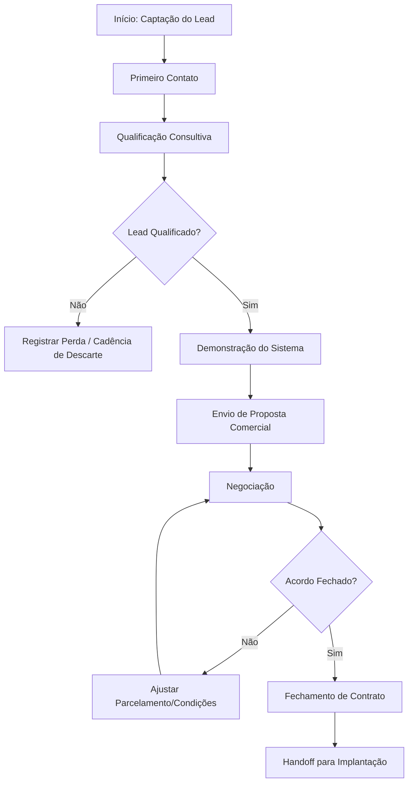

# Análise (IA) — Gravando 2026-08-26 104708.mp4playbook.mp4

**Vídeo:** Gravando 2026-08-26 104708.mp4playbook.mp4

**Processo:** Aquisição e qualificação de leads até o agendamento da apresentação comercial.

---

Aqui está o relatório de auditoria e mapeamento operacional detalhado com base na gravação apresentada.

---

# RAIO-X INDIVIDUAL
**Empresa:** Pontual  
**Processo master:** Estruturação e Documentação Comercial (Elaboração do Playbook Comercial)  
**Vídeo:** Gravacao_Playbook_Comercial.mp4 · **Executor:** Responsável Comercial (Papel A - Locutora) · **Duração:** 05:58 · **Data:** 26/08/2024  

**Resumo:** O vídeo apresenta o planejamento e mapeamento da estrutura do "Playbook Comercial" da empresa Pontual (revendedora de sistemas ERP de pequeno varejo, como Hiper ERP e Automec), gravado pela Responsável Comercial para alinhamento com a consultoria/gestão ("Éric"). O processo exibido é a revisão conceitual e estruturação dos tópicos de integração de novos vendedores, etapas do funil de vendas (do Lead à Implantação) e a transição de scripts manuais para o uso de prompts de Inteligência Artificial nas abordagens.

---

## 2. Descrição narrativa do sistema (para leigo)

A gravação ocorre na interface do **Microsoft Word Online** (acessado via navegador Google Chrome no SharePoint/OneDrive da empresa), onde está aberto o documento intulado **`Playbook Comercial.docx`**. 

O documento está estruturado como um guia de integração (onboarding) e padronização operacional para vendedores da empresa Pontual. Ele é dividido visualmente em tópicos principais:

1. **`1. Conhecendo a Pontual`**: Seção focada em alinhar o contexto institucional e de produto para novos vendedores. Apresenta tópicos que devem conter:
   - Apresentação da empresa (`Quem é a Pontual`).
   - Organograma de funções (`Quem são os funcionários e responsabilidades de cada time`).
   - Portfólio de produtos (`O que é o Hiper ERP e Automec`).
   - Proposta de valor e solução (`Quais problemas os produtos resolvem`, `Principais funcionalidades`, `Diferenciais`).
   - Definição de público-alvo (`Perfil de cliente ideal (ICP)`, `Segmentos prioritários`).
   - Análise de mercado (`Principais concorrentes (aqui podemos fazer uma swot)`).

2. **`2. O processo comercial`**: Seção que define a jornada comercial e os critérios de transição de fase do funil. 
   - **Estágios do Funil (`Organograma do funil`):** `Lead` → `Primeiro contato` → `Qualificação` → `Demonstração` → `Proposta` → `Negociação` → `Fechamento` → `Implantação`.
   - **Campos/Critérios de validação para cada etapa:** Para padronizar a atuação do vendedor, o documento estabelece perguntas obrigatórias de checagem:
     - O significado da etapa.
     - Origem do lead.
     - Funil específico aplicável (`certificado`, `automec`, `hiper`).
     - Ações obrigatórias e informações a coletar (ex.: regime tributário como Simples Nacional/Lucro Presumido/Lucro Real, status de abertura da loja, quantidade de acessos/usuários necessários).
     - Critérios para avanço de fase, perda de oportunidade (descarte) e próxima ação obrigatória.

Além da ferramenta Word, o relato verbal menciona outros sistemas do ecossistema comercial:
- **CRM:** Sistema de gestão de clientes (demonstrado em vídeo anterior) onde os leads são registrados e movimentados.
- **Plataforma EAD:** Ambiente virtual de aprendizagem disponibilizado gratuitamente aos clientes para treinamentos básicos sobre o sistema (necessita de cadastro do cliente, porém encontra-se com conteúdo desatualizado).

---

## 3. Mapeamento e fluxo

### Tabela de Atividades

| # | Timestamp | Atividade | Responsável | Sistema/Ferramenta | Tipo | Tempo | VA/BVA/NVA | Observações |
|---|---|---|---|---|---|---|---|---|
| 1 | 00:00 | Leitura e explicação da necessidade de padronização do processo comercial e ausência de playbook de onboarding | Responsável Comercial | Microsoft Word Online | Ação | ~00:52 | BVA | Relata apoio da Gerente de Contas na estruturação do setor comercial. |
| 2 | 00:53 | Apresentação do capítulo "1. Conhecendo a Pontual" e revisão dos tópicos de produto/ICP | Responsável Comercial | Microsoft Word Online | Ação | ~00:25 | BVA | Detalha a importância de documentar o portfólio (Hiper ERP, Automec) e perfil de cliente ideal. |
| 3 | 01:19 | Navegação e detalhamento do capítulo "2. O processo comercial" e do funil de vendas | Responsável Comercial | Microsoft Word Online | Ação | ~01:14 | BVA | Explica etapas do funil e premissa de qualificação via conversa fluida em vez de questionário rígido. |
| 4 | 02:33 | Descrição da utilização da plataforma EAD de treinamento | Responsável Comercial | Plataforma EAD `[NÃO OBSERVÁVEL]` / Word Online | Ação | ~00:29 | BVA | Menciona EAD gratuita para clientes com cadastro, notando que precisa de atualização. |
| 5 | 03:02 | Explicação das fases de Proposta, Negociação, Fechamento e repasse à Implantação | Responsável Comercial | CRM `[NÃO OBSERVÁVEL]` / Word Online | Ação | ~00:49 | VA | Informa que possui autonomia ("carta branca") para negociar parcelamentos no fechamento. |
| 6 | 03:51 | Discussão sobre transição de scripts engessados para o uso de prompts de Inteligência Artificial | Responsável Comercial | Microsoft Word Online | Decisão | ~01:24 | BVA | Propõe incluir no Playbook diretrizes de prompts para IA criar abordagens adaptadas. |
| 7 | 05:15 | Solicitação de apoio consultivo para finalização da redação do Playbook Comercial | Responsável Comercial | Microsoft Word Online | Handoff | ~00:43 | BVA | Encerra o vídeo endereçando os próximos passos ao consultor "Éric". |

---

### Detalhamento Complementar

* **Pontos de Decisão:**
  - `01:58 - Regime tributário do Lead:` Se o lead for Simples Nacional vs. Lucro Presumido/Lucro Real → Define a complexidade da proposta e adequação do produto comercializado.
  - `04:14 - Tentativas de contato sem resposta:` Se o lead não responder após a 3ª tentativa → Aplicação de script/prompt de reengajamento ou descarte no CRM.

* **Handoffs:**
  - `03:36 (`03:36`)` Fechamento Comercial → Setor de Implantação: Envio do contrato e dados do cliente para início do setup do sistema.
  - `05:40 (`05:40`)` Responsável Comercial → Consultor (Éric): Solicitação de revisão/colaboração na montagem e validação da estrutura final do Playbook.

* **Regras de Negócio Implícitas:**
  - `01:40` A qualificação não deve ser um interrogatório com perguntas diretas, mas sim uma conversa consultiva para extrair dados sem afastar o prospect.
  - `03:18` A Responsável Comercial possui autonomia discricionária ("carta branca") na fase de negociação para alterar parcelamento ou dar descontos sem aprovação prévia de alçada superior.
  - `02:44` O acesso à plataforma EAD é franqueado gratuitamente a todos os clientes cadastrados.

* **Exceções:**
  - `02:51` Clientes acessando treinamento EAD desatualizado: O vendedor precisa intervir manualmente para esclarecer dúvidas sobre funcionalidades modificadas.

---

### Fluxograma do Processo (Mermaid)



---

## 4. Diagnóstico

### Tabela de Problemas Operacionais

| Timestamp | Problema | O que foi observado | Impacto | Severidade | Causa-raiz provável |
|---|---|---|---|---|---|
| 00:48 | Ausência de documentação de processos (Playbook) | Inexistência de um guia padronizado de atendimento e integração para novos vendedores no setor comercial. | Alto risco de variação na qualidade do atendimento, onboarding lento de novos colaboradores e dependência de conhecimento tácito. | Alta | Ausência de cultura de documentação e crescimento desorganizado da operação comercial. |
| 02:51 | Conteúdo de treinamento (EAD) desatualizado | Base de conhecimento e vídeos do EAD disponibilizados aos clientes contêm informações defasadas. | Gerar dúvidas nos clientes, refazer atendimentos de suporte/vendas e passar imagem de desatualização. | Média | Falta de governança de conteúdo e processo de atualização contínua do EAD. |
| 04:00 | Transição incipiente de scripts manuais para IA | Equipe depende de memórias/scripts antigos e busca incluir prompts de IA sem uma biblioteca oficial estruturada. | Perda de produtividade e risco de uso indevido/despadronizado de ferramentas de IA pelos vendedores. | Média | Falta de templates de prompts validados e padronizados no documento Playbook. |

---

### Gargalo Principal DESTE Processo

* **Descrição do Gargalo:** Ausência de padronização documental das etapas de qualificação e abordagem de vendas.
* **Justificativa:** Conforme relatado verbalmente entre `00:30` e `01:10`, a falta de um documento de referência (Playbook) faz com que a empresa dependa exclusivamente da experiência prévia do executor atual. Isso impede o ganho de escala na contratação de novos vendedores e gera oscilação nas taxas de conversão entre diferentes etapas do funil.

---

### Oportunidades Óbvias de Melhoria

1. **Formalização do Playbook com Biblioteca de Prompts de IA (`04:24`):**
   - *Ação:* Preencher as seções do Playbook já mapeadas no Word e anexar um repositório de prompts testados para ChatGPT/Gemini voltados à prospecção e reengajamento.
   - *Ganho:* Redução do tempo de elaboração de mensagens personalizadas e rápida capacitação de novos vendedores.

2. **Revisão e Atualização da Plataforma EAD (`02:51`):**
   - *Ação:* Mapear vídeos defasados na plataforma EAD e regravar pílulas curtas das rotinas básicas do Hiper ERP e Automec.
   - *Ganho:* Redução do tempo gasto pelo vendedor/demonstrador explicando rotinas operacionais básicas durante o ciclo de vendas.

3. **Checklist Obrigatório de Qualificação no CRM (`01:58`):**
   - *Ação:* Incorporar os campos identificados no Word (regime tributário, nº de usuários, status de abertura da loja) como campos de preenchimento estruturado na etapa de qualificação do CRM.
   - *Ganho:* Eliminação de perda de dados e garantia de alinhamento técnico antes da etapa de demonstração.

---

## 5. Métricas (baseline deste vídeo)

* **Lead Time total do processo observado no vídeo:** `05:58` (Tempo de duração da gravação de apresentação/alinhamento).
* **Touch Time (Tempo de trabalho ativo):** `05:58` (A locutora expõe e edita continuamente o documento durante todo o vídeo).
* **Tempo de Espera:** `00:00` (Não houve interrupções de sistema ou travamentos visíveis).
* **Tempo de Retrabalho:** `00:00`.
* **Process Cycle Efficiency (PCE):** `100%` (Toda a gravação consiste na execução contínua da tarefa de explicação/planejamento).
* **Nº de Handoffs observados:** `2` (Comercial → Implantação [mencionado em `03:36`], Responsável Comercial → Consultor Éric [em `05:40`]).
* **Nº de Sistemas Distintos:** `4` (Microsoft Word Online, CRM [citado], Plataforma EAD [citada], WhatsApp/Scripts [citados]).
* **Nº de Etapas Manuais:** `5` (Navegação no Word Online, preenchimento/edição do texto, consulta a tópicos, formulação oral de diretrizes, envio do alinhamento ao consultor).

---

## 6. Sinais para a consolidação

* **Conexões prováveis com outros processos:**
  - O fluxo conecta-se diretamente com a **Operação do CRM** (demonstrada em vídeo anterior enviado ao consultor) e com o processo de **Implantação de Software**.
* **Processos citados mas não demonstrados:**
  - Processo de agendamento e execução de Demonstração técnica.
  - Processo de Implantação pós-fechamento.
  - Processo de cadastro e acesso do cliente à plataforma EAD.
* **Perguntas em aberto para o CS / Validação:**
  - Quais são as regras exatas de concessão de descontos e parcelamentos ("carta branca" mencionada em `03:18`)? Existem limites formais?
  - Qual é a taxa atual de descarte de leads na etapa de qualificação?
  - A plataforma EAD possui métricas de engajamento dos clientes durante a fase de vendas/onboarding?

---

## 7. Bloco de dados estruturado (obrigatório)

```yaml
sistemas_citados: ["Microsoft Word Online", "CRM", "Plataforma EAD", "WhatsApp"]
handoffs: 
  - {de: "Responsável Comercial", para: "Setor de Implantação", item: "Dados do cliente e contrato fechado", timestamp: "03:36"}
  - {de: "Responsável Comercial", para: "Consultor (Éric)", item: "Documento Playbook Comercial para revisão", timestamp: "05:40"}
gargalo_principal: "Ausência de padronização documental (Playbook) e dependência de conhecimento tácito no processo comercial."
conexoes_provaveis: ["Operação do CRM", "Processo de Implantação de Software", "Treinamento via EAD"]
processos_citados_nao_mostrados: ["Demonstração técnica ao vivo", "Rotina de cadastro e onboarding no EAD", "Passagem de bastão para Implantação"]
perguntas_abertas_cs:
  - "Quais são os limites formais da margem de desconto/parcelamento concedida à Responsável Comercial? — [NÃO OBSERVÁVEL] em 03:18"
  - "Quem é responsável por atualizar os conteúdos defasados do EAD? — [NÃO OBSERVÁVEL] em 02:51"
metricas_baixa_confianca: []
```
