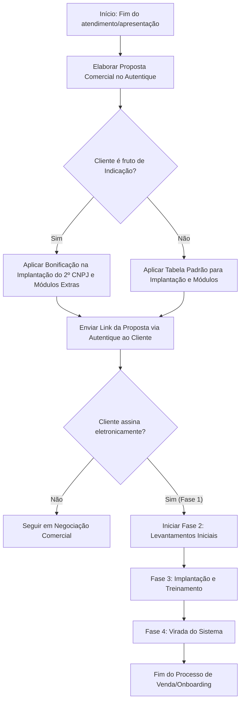

# Análise (IA) — WhatsApp Video 2026-08-26 at 11.21.36.mp4

**Vídeo:** WhatsApp Video 2026-08-26 at 11.21.36.mp4

**Processo:** Aquisição e qualificação de leads até o agendamento da apresentação comercial.

---

Aqui está o relatório de auditoria operacional do processo apresentado no vídeo, elaborado de forma objetiva, detalhada e fundamentada exclusivamente nas evidências observadas.

---

# RAIO-X INDIVIDUAL

**Empresa:** Pontual Tecnologia  
**Processo master:** Elaboração, Apresentação e Envio de Proposta Comercial  
**Vídeo:** Demonstração do Modelo de Proposta Comercial (Autentique)  
**Executor:** Vendedor(a) / Representante Comercial (Lidiane Teixeira)  
**Duração:** 02:58  
**Data:** 26/08/2026 (data de gravação exibida no sistema operacional)  

**Resumo Executivo:**  
O processo cobre a explicação da estrutura de uma proposta comercial enviada a um cliente ("Mega Loja Materiais de Construção LTDA") através da plataforma de assinatura eletrônica *Autentique*. A vendedora detalha as seções do documento (boas-vindas, escopo da solução CLIMB, licenças, investimentos, políticas de bônus por indicação, pré-requisitos técnicos e etapas do projeto). O principal gargalo reside na ausência de padronização/automação para a concessão de bonificações e negociações de preços (regras personalizadas manualmente sem alçada formal explícita). A maior oportunidade é a sistematização de regras comerciais e parametrização direta via CRM/CPQ antes do envio para assinatura.

---

# 2. DESCRIÇÃO NARRATIVA DO SISTEMA (PARA LEIGO)

O vídeo exibe o uso do sistema **Autentique** (`panel.autentique.com.br`), uma plataforma SaaS para gestão de documentos e coleta de assinaturas eletrônicas.

### Como a tela se organiza e funciona:
A tela principal exibe o painel de visualização de documentos do Autentique. Do lado esquerdo, há um menu lateral de navegação contendo:
* **Meus documentos** (com subseções *Signatários* e *Histórico*).
* **Criador do Documento:** Identificado como "Marcelo Piarlon Silva" (Pontual Tecnologia).
* **Lista de Signatários:** Exibe o status de entrega e assinatura do documento por cada envolvido:
  * *Vendedor/Criador:* Marcelo Piarlon Silva (criado em 27/03/2026 às 12:48).
  * *Cliente/Representante:* Exibe nome, CPF (parcialmente mascarado), e-mail do cliente, status (ex.: "Assinou" em 06/04/2026 às 09:00, IP e localização registrados) e botão de reinvio/download.
  * *Testemunha/Treinamento:* Exibe a conta institucional da empresa (`financas@pontualtecnologia.com.br`), status de assinatura e metadados de auditoria.

No centro da tela, é exibido o documento PDF interativo da **Proposta Comercial (Proposta 1171 CB - PROPOSTA MEGA LOJA)**, que contém os seguintes módulos/páginas:

1. **Capa e Apresentação Institucional:** Identificação visual da Pontual Tecnologia e mensagem de boas-vindas.
2. **Objetivo do Projeto:** Define a instalação da solução de software **CLIMB** para a empresa contratante (**MEGA LOJA MATERIAIS DE CONSTRUCAO LTDA**), identificando os CNPJs atendidos (1º CNPJ matriz e 2º CNPJ filial) e a pessoa responsável pelo projeto no cliente (Srª. Andressa).
3. **Escopo do Licenciamento e Implantação:** Define a concessão de uso da ferramenta (módulos contratados) e o pacote de serviços de implantação (parametrização, instalação online, monitoria, suporte e treinamento).
4. **Tabela de Investimento:**
   * **Configurações e Implantação:** Campo com valor fixo para o 1º CNPJ (`R$ 4.890,00`) e campo para o 2º CNPJ (`Bonificado` / parcelamento configurado).
   * **Manutenção Mensal:** Regra fixada em `1/3 do Salário Mínimo` cobrindo ambos os CNPJs.
   * **Licença Anual Flexdocs:** Cobrança de valor fixo (`R$ 150,00` por CNPJ/ano) destinada à infraestrutura de emissão de notas fiscais eletrônicas (NF-e/NFC-e).
5. **Investimentos Extras (Opcionais):** Tabela de módulos/serviços adicionais (Consulta Pix, Mensagem WhatsApp, Portal do Contador, Configuração de Boletos Bancários).
6. **Premissas Técnicas e Cláusulas:** Módulo contendo os requisitos mínimos de hardware/sistema operacional (Servidor e Estação de Trabalho), política de confidencialidade, infraestrutura, condições de cancelamento, inadimplência e termo de aceite eletrônico.
7. **Fases e Suporte:** Cronograma resumido em 4 fases (Aceite -> Levantamento -> Implantação -> Virada do Sistema) e canais de atendimento.

---

# 3. MAPEAMENTO E FLUXO

| # | Timestamp | Atividade | Responsável | Sistema/Ferramenta | Tipo | Tempo | VA/BVA/NVA | Observações |
|---|---|---|---|---|---|---|---|---|
| 1 | 00:00 | Abertura da apresentação e contextualização sobre o envio de propostas comerciais pós-atendimento | Papel: Vendedor(a) | Autentique | Ação | 00:19 | BVA | Apresentação inicial do fluxo comercial. |
| 2 | 00:20 | Navegação pelas páginas de apresentação institucional e objetivos da proposta no PDF | Papel: Vendedor(a) | Autentique | Ação | 00:37 | VA | Detalhamento do cliente (Mega Loja) e da solução (CLIMB). |
| 3 | 00:58 | Exposição dos termos de licença de uso do software e escopo de implantação | Papel: Vendedor(a) | Autentique | Ação | 00:06 | VA | Apresenta os serviços incluídos no processo de implantação. |
| 4 | 01:04 | Detalhamento dos custos de implantação, mensalidade recorrente e taxas anuais de NF-e | Papel: Vendedor(a) | Autentique | Ação / Decisão | 00:43 | VA | Explicação verbal do motivo da bonificação do 2º CNPJ (cliente vindo de indicação). |
| 5 | 01:48 | Apresentação dos investimentos extras/opcionais e serviços bonificados no ecossistema | Papel: Vendedor(a) | Autentique | Ação | 00:30 | VA | Demonstração de ferramentas adicionais (Pix, WhatsApp, Contador, Boletos). |
| 6 | 02:19 | Exibição das cláusulas de planejamento, confidencialidade e estruturação operacional | Papel: Vendedor(a) | Autentique | Ação | 00:05 | BVA | Termos de governança e proteção de dados. |
| 7 | 02:24 | Apresentação da infraestrutura técnica mínima recomendada (Servidor e Workstation) | Papel: Vendedor(a) | Autentique | Ação | 00:11 | BVA | Requisitos computacionais exigidos para o funcionamento do sistema. |
| 8 | 02:35 | Exposição dos termos de aceite eletrônico e resumo das 4 fases da implantação | Papel: Vendedor(a) | Autentique | Ação | 00:08 | VA | Fases: Aceite, Levantamento, Implantação e Virada de Sistema. |
| 9 | 02:43 | Apresentação dos canais de suporte, política de treinamento, inadimplência e cancelamento | Papel: Vendedor(a) | Autentique | Ação | 00:08 | BVA | Regras operacionais e financeiras de vigência do contrato. |
| 10 | 02:51 | Encerramento com exibição dos contatos comerciais e endereço de correspondência | Papel: Vendedor(a) | Autentique | Ação | 00:07 | BVA | Fim da apresentação da proposta. |

### Pontos de Decisão
* **Condição de Bonificação (01:08 - 01:25):** Se o cliente é proveniente de indicação externa (`Sim` / `Não`) → **Caminho A (Indicação):** Bonifica-se o custo de implantação do 2º CNPJ e isentam-se módulos extras (Consulta Pix, WhatsApp, Portal do Contador). **Caminho B (Padrão):** Cobra-se taxa de implantação integral para múltiplos CNPJs e tabela cheia nos opcionais.

### Handoffs
* **Vendas (Representante Comercial) → Cliente (00:15 / 02:36):** A proposta é enviada via link do Autentique para validação e assinatura eletrônica do cliente.
* **Cliente → Vendas / Implantação (02:39):** Após o habite-se/aceite no Autentique (Fase 1), o projeto transita para a equipe de Implantação (Fase 2 - Levantamentos Iniciais).

### Regras de Negócio Implícitas
1. **[01:05] Custo de Implantação Padrão:** O 1º CNPJ é tarifado no valor fixo de R$ 4.890,00 (podendo ser parcelado em 1+14 vezes).
2. **[01:28] Recorrência de Mensalidade:** A taxa de manutenção mensal para até 2 CNPJs é atrelada ao valor de `1/3 do Salário Mínimo` vigente.
3. **[01:40] Licenciamento Fiscal Exsógeno (Flexdocs):** Cobrança obrigatória e adicional de R$ 150,00/ano por CNPJ para emissão de documentos fiscais eletrônicos.
4. **[01:48] Isenção Comercial Discrecionária:** Ferramentas de ecossistema (Pix, WhatsApp, Portal do Contador) podem ter a taxa convertida em "Bonificado" mediante negociação comercial manual.
5. **[02:25] Requisito Técnico Mínimo de Servidor:** Exige CPU 2.8GHz+, 16GB RAM, HD 1TB, HD Externo para backup e Windows 10/11.

### Exceções
* **Abono de Implantação de Filial/Segundo CNPJ (01:08):** Tratamento concedido especificamente devido à origem da conta por indicação, onde a taxa de implantação do segundo CNPJ foi 100% bonificada, mantendo-se apenas o reajuste proporcional da mensalidade.

### Diagrama de Processo (Mermaid)



---

# 4. DIAGNÓSTICO

### Tabela de Problemas Observados

| Timestamp | Problema | O que foi observado | Impacto | Severidade | Causa-raiz provável |
|---|---|---|---|---|---|
| 01:10 | Regra comercial de bonificação informal/manual | Vendedora justifica em áudio que bonificou o 2º CNPJ e módulos por ser "indicação", sem menção a parâmetros rígidos na proposta | Risco de margem de lucro reduzida e falta de padronização comercial | Média | Ausência de política formal de descontos parametrizada em CRM/CPQ |
| 01:28 | Precificação atrelada a índice externo dinâmico (Salário Mínimo) | A manutenção mensal está descrita como "1/3 Salário Mínimo" em texto corrido no documento | Risco de divergência em faturamento/cobrança recorrente automatizada | Média | Definição manual de contratos sem tabela de preços em moeda corrente parametrizada |
| 00:00 | Processo de geração de proposta externo e descentralizado | Proposta é elaborada e formatada visualmente como documento PDF estático e subida no Autentique | Tempo gasto na criação manual de PDFs; risco de erro de digitação de valores | Média | Falta de integração nativa do sistema ERP/CRM com emissor de propostas/contratos |

### Gargalo Principal (Teoria das Restrições)
**Ajuste e Consecução Manual da Proposta Comercial (01:05 - 01:50):** O maior gargalo do fluxo de vendas mostrado é o esforço humano empregado para personalizar manualmente termos econômicos (isenção de taxas, bonificação de ecossistema, cálculo de frações de salário mínimo e redação de cláusulas específicas) em um documento de texto/PDF antes de enviá-lo ao Autentique.

### Oportunidades Óbvias de Melhoria
1. **Parametrização de Regras Comerciais (CPQ):** Implementar motor de regras de negócio em que descontos/bonificações por indicação sejam validados automaticamente via sistema com alçadas de aprovação claras. *(Ganho: Redução de risco financeiro e padronização comercial)*.
2. **Geração Automática de Contratos via CRM/ERP:** Automatizar a geração da proposta diretamente dos dados do cliente/oportunidade, integrando a API do ERP com a API do Autentique. *(Ganho: Eliminação do tempo de confecção manual de propostas e erro humano em valores)*.
3. **Fixação Nominal de Valores de Recorrência:** Converter expressões como "1/3 Salário Mínimo" em valores nominais em Reais (R$) com cláusula clara de reajuste anual por índice inflacionário (ex.: IPCA/IGP-M). *(Ganho: Eficiência no faturamento recorrente e clareza contratual)*.

---

# 5. MÉTRICAS (BASELINE DESTE VÍDEO)

* **Lead Time Total Observado:** `02:58` (Tempo total do vídeo explicativo do modelo de proposta).
* **Touch Time (Tempo de Ação Direta):** `02:58` (Apresentação contínua executada pela vendedora).
* **Tempo de Espera Observado:** `00:00` (Não houve travamento de tela ou espera de carregamento durante a gravação).
* **Tempo de Retrabalho Observado:** `00:00`.
* **Process Cycle Efficiency (PCE):** `100%` (dentro da gravação demonstrativa realizada).
* **Número de Handoffs Observados:** `2` (Vendedor -> Cliente via link; Cliente -> Equipe de Implantação pós-assinatura).
* **Número de Sistemas Distintos Exibidos:** `1` (*Autentique* na web browser).
* **Número de Etapas Manuais Exibidas:** `10` (rolagem, leitura e verificação dos blocos constitutivos da proposta comercial).

---

# 6. SINAIS PARA A CONSOLIDAÇÃO

* **Conexões prováveis com outros processos:**
  * **CRM / Pré-Vendas:** De onde vêm os dados cadastrais do cliente, escopo levantado e a indicação comercial.
  * **Financeiro / Faturamento:** Receberá a proposta assinada para emitir as cobranças (R$ 4.890,00 em 1+14x e cobrança anual de R$ 150,00/CNPJ).
  * **Operação / Implantação:** Receberá a notificação de aceite para iniciar a "Fase 2 - Levantamentos Iniciais".
* **Processos citados mas não demonstrados:**
  * Processo prévio de atendimento/apresentação técnica do sistema CLIMB.
  * Geração e upload do arquivo PDF dentro da plataforma Autentique.
  * Assinatura digital efetiva em tempo real pelo cliente.
  * Execução técnica do treinamento e virada de chave do sistema.
* **Perguntas em aberto para o CS:**
  * Existe um limite formal de descontos/bonificações que um vendedor pode conceder sem aprovação da diretoria? `[INFERÊNCIA]`
  * Como é feita a atualização do valor da mensalidade no sistema financeiro quando o salário mínimo nacional sofre reajuste? `[NÃO OBSERVÁVEL em 01:28]`

---

# 7. BLOCO DE DADOS ESTRUTURADO

```yaml
sistemas_citados: ["Autentique", "CLIMB", "Flexdocs"]
handoffs: 
  - de: "Vendedor(a) / Representante Comercial"
    para: "Cliente"
    item: "Link da Proposta Comercial no Autentique"
    timestamp: "00:15"
  - de: "Cliente"
    para: "Equipe de Implantação"
    item: "Aceite Eletrônico da Proposta (Fase 1 concluída)"
    timestamp: "02:39"
gargalo_principal: "Montagem e personalização manual de concessões financeiras/bonificações em PDF estático antes do envio para assinatura"
conexoes_provaveis: ["CRM / Vendas", "Financeiro / Cobrança", "Implantação / Onboarding de Clientes"]
processos_citados_nao_mostrados: ["Atendimento e Demonstração do CLIMB", "Upload do Documento no Autentique", "Execução do Treinamento e Configuração do Servidor"]
perguntas_abertas_cs: ["Qual é a alçada máxima de bonificação permitida para os vendedores sem aprovação superior? — [INFERÊNCIA em 01:10]", "Como a empresa reajusta o valor de 1/3 de salário mínimo no ERP de cobrança financeira? — [NÃO OBSERVÁVEL em 01:28]"]
metricas_baixa_confianca: []
```
