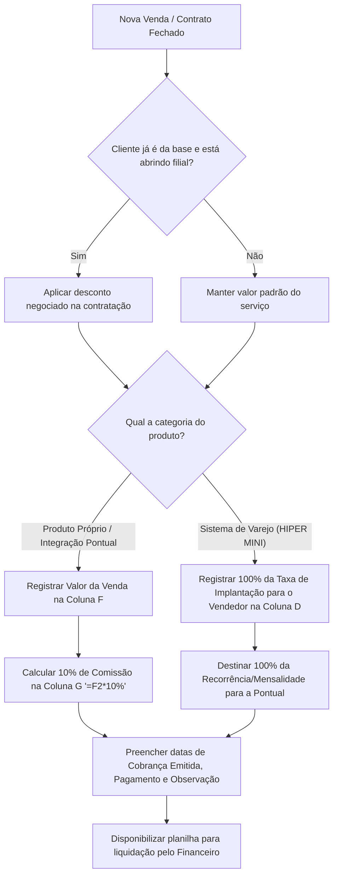

# Análise (IA) — WhatsApp Video 2026-08-26 at 11.21.45.mp4

**Vídeo:** WhatsApp Video 2026-08-26 at 11.21.45.mp4

**Processo:** Aquisição e qualificação de leads até o agendamento da apresentação comercial.

---

## 1. RAIO-X INDIVIDUAL

```
RAIO-X INDIVIDUAL
Empresa: Pontual Tecnologia · Processo master: Gestão Comercial e Apuração de Comissões
Vídeo: Comissão Comercial.xlsx · Executor: Vendedora / Responsável Comercial (Udiane) · Duração: 02:36 · Data: 28/08/2024
```

**Resumo:**
O processo compreende o registro manual de contratos e vendas e o cálculo das respectivas comissões dos executores comerciais em uma planilha do Microsoft Excel Online. O gatilho é o fechamento de uma venda ou contratação de nova filial/serviço, e o resultado é a definição do valor de comissão a pagar e a data de liquidação. O principal gargalo é o preenchimento totalmente manual da planilha sem integração automática com o sistema de faturamento/CRM. A maior oportunidade é automatizar a apuração de comissões via integração entre o ERP/CRM e o módulo financeiro.

---

## 2. Descrição narrativa do sistema (para leigo)

O processo utiliza a planilha **Comissão Comercial.xlsx**, executada no **Microsoft Excel Online** (hospedado no Microsoft SharePoint / OneDrive). A planilha é estruturada em abas mensais na parte inferior (`Agosto 26`, `Julho 26`, `Junho 26`, `Maio 26`, `Abril 26`, `Março 26`, `Fevereiro 26`, `Janeiro 26`, `Dezembro 25`).

Na aba ativa (`Julho 26`), a tabela de controle possui os seguintes campos literais:
- **Data da Venda** (Coluna A): Data em que o contrato/venda foi fechado (formato `DD/MM/AAAA`).
- **Cliente** (Coluna B): Código e Razão Social/Nome do cliente (ex.: `433 - ARRUDA COMÉRCIO`, `434 - GERSON DE SOUZA BRITO JUNIOR`).
- **Serviço / Produto** (Coluna C): Identificação do produto, módulo ou serviço contratado (ex.: `AUTOMEC - ADIÇÃO DE CNPJ`, `AUTOMEC`, `CERTIFICADO`, `BACKUP DIÁRIO`, `FGF`, `HIPER MINI`).
- **Udiane** (Coluna D): Valor devido/atribuído à executora Udiane (Vendedora).
- **Adriano** (Coluna E): Valor total da venda/serviço realizado pelo executor Adriano (Gerente de Operações que também realiza vendas).
- **Valor da Venda** (Coluna F): Valor total negociado/cobrado do cliente pelo serviço ou implantação.
- **Comissão / Outros** (Coluna G): Valor de comissão calculado (contém a fórmula `=F2*10%` para calcular 10% sobre o valor da venda registrado na Coluna F).
- **Cobrança emitida** (Coluna H): Data limite/prevista para emissão da cobrança ao cliente.
- **Pagamento** (Coluna I): Data limite/efetiva do pagamento da comissão ao vendedor.
- **Observação** (Coluna J): Informações adicionais de acompanhamento e status do pagamento (ex.: `a pagar em DD/MM/AAAA`, `SERÁ TRANSFERIDO PELA FGF EM 15/09`).

### Regras de Negócio e Comissionamento Explicadas:
1. **Desconto para Filiais de Clientes Base:** Quando um cliente já ativo na base abre uma nova filial/loja, a empresa concede um desconto comercial na contratação da nova unidade, ajustado conforme a disponibilidade e negociação prévia com esse cliente.
2. **Produtos Próprios / Ferramentas / Integradores Pontual:** Para produtos e serviços próprios da empresa (como `AUTOMEC`, `CERTIFICADO`, `BACKUP DIÁRIO`, `FGF`), o vendedor/gerente (ex.: Adriano) recebe **10% de comissão** calculada sobre o valor total da taxa de implantação/venda (`Valor da Venda`).
3. **Sistema de Varejo (HIPER MINI):** 
   - A taxa de implantação (primeira parcela/custo inicial cobrado na negociação) é repassada em **100% para o vendedor** (registrado na coluna do vendedor, ex.: R$ 600,00 na coluna `Udiane`).
   - A receita recorrente (mensalidades do sistema) fica em **100% para a Pontual Tecnologia**.

---

## 3. Mapeamento e fluxo

### Tabela Passo a Passo

| # | Timestamp | Atividade | Responsável | Sistema/Ferramenta | Tipo | Tempo | VA/BVA/NVA | Observações |
|---|---|---|---|---|---|---|---|---|
| 1 | 00:00 | Acessar e apresentar a planilha `Comissão Comercial.xlsx` e navegação entre abas mensais | Vendedora (Udiane) | Microsoft Excel Online | Ação | ~00:12 | BVA | Apresentação da estrutura geral da planilha por mês. |
| 2 | 00:12 | Registrar dados cadastrais da venda (`Data da Venda`, `Cliente`, `Serviço / Produto`) | Vendedora (Udiane) | Microsoft Excel Online | Ação | ~00:11 | BVA | Entrada inicial do contrato na linha correspondente. |
| 3 | 00:23 | Avaliar elegibilidade de desconto para cliente da base abrindo filial | Vendedora (Udiane) | Microsoft Excel Online | Decisão | ~00:27 | BVA | Verificação manual da condição de cliente já existente. |
| 4 | 00:50 | Registrar vendas atribuídas ao Gerente de Operações (`Adriano`) e calcular comissão de 10% | Vendedora (Udiane) | Microsoft Excel Online | Ação | ~00:30 | BVA | Inserção do valor da venda na Coluna F e cálculo automático via fórmula `=F2*10%` na Coluna G. |
| 5 | 01:20 | Identificar regras específicas por tipo de produto (`HIPER MINI` vs. Produtos Pontual) | Vendedora (Udiane) | Microsoft Excel Online | Decisão | ~00:43 | BVA | Seleção da regra de comissão aplicável. |
| 6 | 02:03 | Consolidação e validação visual dos valores de comissão e datas de pagamento (`Observação`) | Vendedora (Udiane) | Microsoft Excel Online | Ação | ~00:33 | BVA | Checagem das colunas de pagamento e observações financeiras. |

### Detalhamento Complementar

- **Pontos de Decisão:**
  - **Tipo de Cliente (00:23):** Se o cliente é um cliente novo → cobra valor cheio de tabela; Se é cliente já existente abrindo filial → concede desconto negociado na taxa de contratação.
  - **Tipo de Produto/Serviço (01:20):** Se for produto próprio/integração Pontual → atribui 10% de comissão sobre a implantação na coluna `Comissão / Outros`; Se for sistema de varejo `HIPER MINI` → destina 100% do valor da taxa de implantação para o vendedor na coluna individual (`Udiane`) e a recorrência para a empresa.

- **Handoffs:**
  - **01:56 – 02:02:** Handoff interno entre Comercial (Udiane/Adriano) e o Setor Financeiro (FGF / Cobrança). O setor comercial registra os dados na planilha e o setor financeiro realiza a emissão de cobranças e pagamento das comissões nas datas sinalizadas na coluna `Observação`.

- **Regras de Negócio Implícitas:**
  - `[00:23]` Descontos comerciais para filiais não possuem tabela fixa visível no vídeo; são definidos pontualmente via negociação com o cliente.
  - `[00:56]` O Gerente de Operações (Adriano) possui cota/papel duplo, atuando na operação e gerando vendas comissionadas.
  - `[02:03]` Para sistemas Pontual, a comissão é sempre fixada em 10% sobre o campo `Valor da Venda` (fórmula `=F2*10%`).

- **Exceções:**
  - `[01:56]` Acordo específico de repasse de comissão por parceiro externo/colaborador registrado em observação: `SERÁ TRANSFERIDO PELA FGF EM 15/09`.

### Diagrama Mermaid



---

## 4. Diagnóstico

### Tabela de Problemas Encontrados

| Timestamp | Problema | O que foi observado | Impacto (tempo/qualidade/risco) | Severidade | Causa-raiz provável |
|---|---|---|---|---|---|
| 00:12 | Registro manual de vendas em planilha | A vendedora digita manualmente datas, nomes de clientes, códigos e produtos em planilha Excel Online. | Alto risco de erro de digitação, duplicação de dados e gasto de tempo operacional. | Alta | Ausência de integração automática entre CRM e planilha/financeiro. |
| 00:23 | Regra de desconto informal/despadronizada | Concessão de desconto para filiais baseada na "disponibilidade do cliente", sem tabela clara parametrizada. | Risco de margem de lucro inconsistente e perda de previsibilidade de receita. | Média | Falta de política comercial rígida parametrizada no sistema. |
| 01:20 | Apuração de comissão com regras híbridas em planilha | Diferenciação manual de regras de comissionamento (10% vs 100% da implantação) dentro da mesma planilha. | Risco de erro nos cálculos e de pagamentos incorretos de comissão. | Média | Falta de módulo de comissionamento automatizado no ERP. |

- **Gargalo principal DESTE processo:** Entrada manual de dados e apuração de comissionamento em planilha Excel Online. Todo o controle depende da digitação e conferência humana linha a linha, gerando retrabalho e risco de inconsistência com o faturamento real.
- **Oportunidades óbvias:**
  1. **Automação do cálculo de comissão no ERP (00:50 - 01:20):** Configurar as regras de comissionamento (10% para produtos próprios e 100% da taxa de implantação para o HIPER MINI) diretamente no ERP/CRM da empresa, eliminando a planilha manual. *(Ganho: Redução de ~90% no tempo de apuração e risco zero de erro de cálculo)*.
  2. **Padronização da política de desconto para filiais (00:23):** Criar uma tabela parametrizada de descontos para novas filiais no sistema de vendas. *(Ganho: Proteção de margem de lucro e agilidade na aprovação comercial)*.

---

## 5. Métricas (baseline deste vídeo)

- **Lead Time total:** `02:36` (duração total da explicação/demonstração do processo no vídeo).
- **Touch time:** `~02:36` (tempo total em que a executora navega e explica a planilha de forma ativa).
- **Tempo de espera:** `00:00` (não foram observadas pausas de espera por sistema ou terceiros durante o vídeo).
- **Tempo de retrabalho:** `00:00` (não observado retrabalho explícito no vídeo).
- **Process Cycle Efficiency (PCE):** `100%` (dentro da amostra do vídeo, todo o tempo foi touch time ativo de explicação/registro).
- **Nº de handoffs:** `1` (Handoff do Comercial para o Financeiro/FGF para liquidação da comissão e emissão de cobrança).
- **Nº de sistemas distintos:** `1` (Microsoft Excel Online no navegador Google Chrome).
- **Nº de etapas manuais:** `6` (navegação entre abas, digitação de venda, verificação de desconto, inserção de valor/fórmula de comissão, separação por regra de produto, preenchimento de observações/datas).

---

## 6. Sinais para a consolidação

- **Conexões prováveis com outros processos:**
  - Processo de **Faturamento e Cobrança** (utiliza as datas da Coluna H e I para emitir boletos/cobranças).
  - Processo de **Contas a Pagar / Pagamento de Comissões** (utiliza as observações e valores apurados nas colunas D, E e G).
  - Processo de **Implantação de Sistemas** (o produto contratado na Coluna C dispara a ordem de serviço de implantação do sistema).
- **Processos citados mas não demonstrados:**
  - Negociação comercial e fechamento do contrato com o cliente.
  - Processo de transferência/pagamento de comissão executado pelo setor `FGF` (`[01:56]`).
  - Emissão efetiva da cobrança ao cliente pelo financeiro.
- **Perguntas em aberto para o CS:**
  - Como é realizada a validação entre as vendas registradas na planilha e os recebimentos efetivos dos clientes antes de liberar o pagamento da comissão? — `[INFERÊNCIA em 01:56]`
  - Quais são os critérios limite para os descontos concedidos na abertura de filiais? — `[NÃO OBSERVÁVEL em 00:23]`

---

## 7. Bloco de dados estruturado

```yaml
sistemas_citados: ["Microsoft Excel Online", "Google Chrome"]
handoffs: [{de: "Vendedora (Udiane)", para: "Financeiro / FGF", item: "Valores de comissão e datas para pagamento", timestamp: "01:56"}]
gargalo_principal: "Controle e apuração manual de comissões via planilha Excel sem integração com o ERP/faturamento"
conexoes_provaveis: ["Processo de Faturamento e Cobrança", "Processo de Contas a Pagar / Comissões", "Processo de Implantação de Sistemas"]
processos_citados_nao_mostrados: ["Fechamento de venda/negociação", "Pagamento de comissão pela FGF", "Emissão de cobrança ao cliente"]
perguntas_abertas_cs: ["Como o Financeiro valida o recebimento do cliente antes de pagar a comissão? — [INFERÊNCIA] em 01:56", "Qual a regra/limite formal para o desconto de filiais? — [NÃO OBSERVÁVEL] em 00:23"]
metricas_baixa_confianca: []
```
